# 前后端分离 SpringBoot整合SpringSecurity权限控制（动态拦截url）

> Spring Security是一个功能强大且可高度自定义的身份验证和访问控制框架。它是保护基于Spring的应用程序的事实上的标准。
>
> Spring Security是一个专注于为Java应用程序提供身份验证和授权的框架。与所有Spring项目一样，Spring Security的真正强大之处在于它可以轻松扩展以满足自定义要求。

**项目完整功能：**

1. 登录（根据所登录用户所具有的权限返回给前端JSON数据，动态的展示功能菜单）。
2. 注销。
3. 动态拦截url请求，根据当前登录用户所具有的权限，进行权限认证（防止不具有权限的用户直接通过url请求功能）。
4. 用户管理模块（查询所有用户[分页加模糊查询]、新增用户、修改用户、删除用户、为用户分配角色）。
5. 角色管理模块（查询所有角色[分页加模糊查询]、新增角色、修改角色、删除角色、为角色分配可访问的资源菜单）。
6. 菜单管理模块（查询所有菜单、新增菜单、修改菜单、删除菜单）。
7. 登录验证中增加额外数据（如ip地址，mac地址，验证码等）。
8. 其他(后期看能否添加定时任务,Aop等登录日志以及操作日志)


# spring-security简介并与shiro对比

1. Shiro比Spring更容易使用，实现和最重要的理解
2. Spring Security更加知名的唯一原因是因为品牌名称
3. "Spring"以简单而闻名，但讽刺的是很多人发现安装Spring Security很难
4. 然而，Spring Security却有更好的社区支持
5. Apache Shiro在Spring Security处理密码学方面有一个额外的模块
6. Spring-security 对Spring结合较好，如果项目用的SpringMVC，使用起来很方便。但是如果项目中没有用到Spring，那就不要考虑它了。
7. Shiro 功能强大、简单、灵活。是Apache 下的项目比较可靠，且不跟任何的框架或者容器绑定，可以独立运行

# 项目搭建

本篇文章环境：SpringBoot 2.x + Mybatis/MyBatis-Plus + Spring Security 5.x

**注意：SpringSecurity 5.0+ 版本变动较多，且不兼容之前版本，确保你的 SpringBoot 版本为 2.0，能帮你避免掉大部分的坑。**

## 需求分析

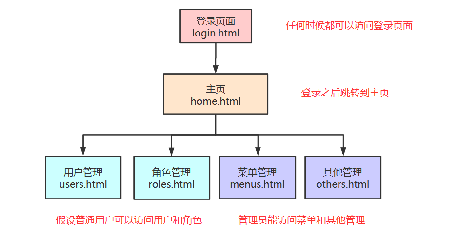

- login.html为登录页面,都可以访问
- 在登录成功之后，进入home.html主页
- 主页中有四个超链接,分别对应我们将要实现的四个功能用户管理、角色管理...
- 但是四个页面需要有不同的权限,主要看红色的字体

## 创建项目


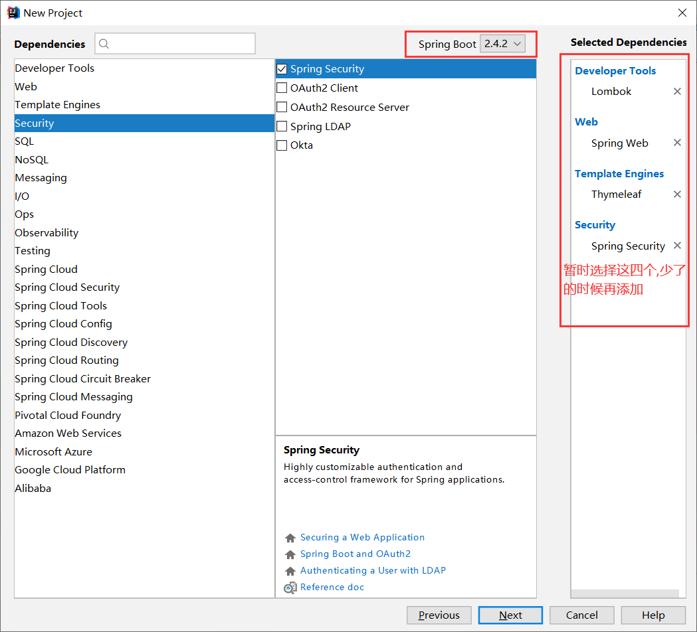


## 准备页面

因为是示例程序，页面越简单越好，只用于登陆的`login.html`将其放置在 `resources/public` 目录下：

(1)login.html：

```html
<!DOCTYPE html>
<html lang="en">
<head>
    <meta charset="UTF-8">
    <title>用户登录</title>
</head>
<body>
<!--所有课件都是由小哥编写,仅供学习-->
<form action="/login" method="post">
    <p>
        <label for="username">用户名:</label>
        <input type="text" id="username" name="username">
    </p>
    <p>
        <label for="password">密码:</label>
        <input type="text" id="password" name="password">
    </p>
    <p><input type="submit" value="登录"></p>
</form>
</body>
</html>
```

> 用户的登陆认证是由Spring Security进行处理的，请求路径默认为`/login`，用户名字段默认为`username`，密码字段默认为`password`

我这里使用的模板引擎Thymeleaf,你们可以根据自己的喜好进行选择,这些页面我就放在`resources/templates`目录下了:

(2)home.html：

```html
<!DOCTYPE html>
<html lang="en">
<head>
    <meta charset="UTF-8">
    <title>主页面</title>
</head>
<body>
<h1>登陆成功</h1>
    <a href="/users">用户管理</a>
<br/>
    <a href="/roles">角色管理</a>
<br/>
    <a href="/menus">菜单管理</a>
<br/>
    <a href="/others">其他管理</a>
<br/>
<button onclick="window.location.href='/logout'">退出登录</button>
</body>
</html>
```

> 用户的注销也是由Spring Security进行处理的，请求路径默认为`/logout`

(3)users.html：

```html
<!DOCTYPE html>
<html lang="en">
<head>
    <meta charset="UTF-8">
    <title>用户管理</title>
</head>
<body>
<h1>用户管理</h1>
</body>
</html>
```

(4)roles.html：

```html
<!DOCTYPE html>
<html lang="en">
<head>
    <meta charset="UTF-8">
    <title>角色管理</title>
</head>
<body>
<h1>角色管理</h1>
</body>
</html>
```

(5)menus.html：

```html
<!DOCTYPE html>
<html lang="en">
<head>
    <meta charset="UTF-8">
    <title>菜单管理</title>
</head>
<body>
<h1>菜单管理</h1>
</body>
</html>
```

(6)others.html：

```html
<!DOCTYPE html>
<html lang="en">
<head>
    <meta charset="UTF-8">
    <title>其他管理</title>
</head>
<body>
<h1>其他管理</h1>
</body>
</html>
```

## 编写控制器类

SecurityController

```java
package com.xiaoge.controller;

import org.springframework.stereotype.Controller;
import org.springframework.web.bind.annotation.GetMapping;

@Controller
public class SecurityController {

    /**
     * 主页面
     * @return
     */
    @GetMapping("/home")
    public String home(){
        return "home";
    }

    /**
     * 用户管理
     * @return
     */
    @GetMapping("/users")
    public String users(){
        return "users";
    }

    /**
     * 角色管理
     * @return
     */
    @GetMapping("/roles")
    public String roles(){
        return "roles";
    }

    /**
     * 菜单管理
     * @return
     */
    @GetMapping("/menus")
    public String menus(){
        return "menus";
    }

    /**
     * 其他管理
     * @return
     */
    @GetMapping("/others")
    public String others(){
        return "others";
    }

    @GetMapping("/error")
    public String error(){
        return "error";
    }
}
```

## 项目结构


# HttpBasic模式登录认证

## HttpBasic模式的应用场景

HttpBasic登录验证模式是Spring Security实现登录验证最简单的一种方式，也可以说是最简陋的一种方式。它的目的并不是保障登录验证的绝对安全，而是提供一种“防君子不防小人”的登录验证。

就好像是我小时候写日记，都买一个带小锁头的日记本，实际上这个小锁头有什么用呢？如果真正想看的人用一根钉子都能撬开。它的作用就是：某天你的父母想偷看你的日记，拿出来一看还带把锁，那就算了吧，怪麻烦的。

举一个我使用HttpBasic模式的进行登录验证的例子：我曾经在一个公司担任部门经理期间，开发了一套用于统计效率、分享知识、生成代码、导出报表的Http接口。纯粹是为了工作中提高效率，同时我又有一点点小私心，毕竟各部之间是有竞争的，所以我给这套接口加上了HttpBasic验证。公司里随便一个技术人员，最多只要给上一两个小时，就可以把这个验证破解了。说白了，这个工具的数据不那么重要，加一道锁的目的就是不让它成为公开数据。如果有心人破解了，真想看看这里面的数据，其实也无妨。这就是HttpBasic模式的典型应用场景。

## 实现HttpBasic登录认证

**如果使用的Spring Boot版本为1.X版本,依赖的Security 4.X版本，那么就无需任何配置，启动项目访问则会弹出默认的httpbasic认证.**

我们现在使用的是spring boot2.0版本（依赖Security 5.X版本），HttpBasic不再是默认的验证模式，在spring security 5.x默认的验证模式已经是表单模式。所以我们要使用Basic模式，需要自己调整一下。并且`security.basic.enabled`已经过时了，所以我们需要自己去编码实现。

新建包auth,专门用来实现权限认证

创建类`WebSecurityConfig`，继承`WebSecurityConfigurerAdapter`类,重写三个`configure`方法,暂时先写着,后面再解释干嘛的

> WebSecurityConfigurerAdapter是适配器类, 在配置的时候需要我们自己写配置类去继承他,然后编写自己所特殊需要的配置

```java
@Configuration
public class WebSecurityConfig extends WebSecurityConfigurerAdapter {

    @Override
    protected void configure(AuthenticationManagerBuilder auth) throws Exception {
        super.configure(auth);
    }

    @Override
    public void configure(WebSecurity web) throws Exception {
        super.configure(web);
    }

    @Override
    protected void configure(HttpSecurity http) throws Exception {
        //开启httpBasic认证
        http.httpBasic()
            	//每个模块配置使用and结尾
                .and()
            	//配置路径拦截，表明路径访问所对应的权限，角色，认证信息
                .authorizeRequests()
                .anyRequest()
                //所有请求都需要登录认证才能访问
                .authenticated();
    }
}
```

配置完之后启动项目,可以看到如下信息：

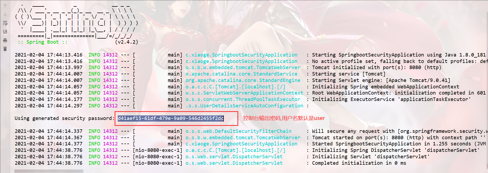

访问：http://localhost:8080/home


输入用户名密码,成功进入主页

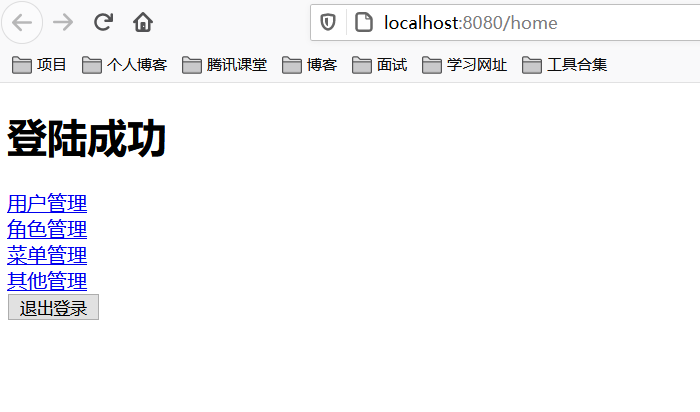

## 默认表单模式

注释掉刚刚写的配置类代码,重新启动项目运行,默认其实是使用的表单模式认证的,就是我们接下来要讲的formLogin模式

```java
//注释掉这里就行了
//@Configuration
public class WebSecurityConfig extends WebSecurityConfigurerAdapter {

    @Override
    protected void configure(AuthenticationManagerBuilder auth) throws Exception {
        super.configure(auth);
    }

    @Override
    public void configure(WebSecurity web) throws Exception {
        super.configure(web);
    }

    @Override
    protected void configure(HttpSecurity http) throws Exception {
        //开启httpBasic认证
        http.httpBasic()
                .and()
                .authorizeRequests()
                .anyRequest()
                //所有请求都需要登录认证才能访问
                .authenticated();
    }
}
```

启动项目重新运行,继续访问 http://localhost:8080/home

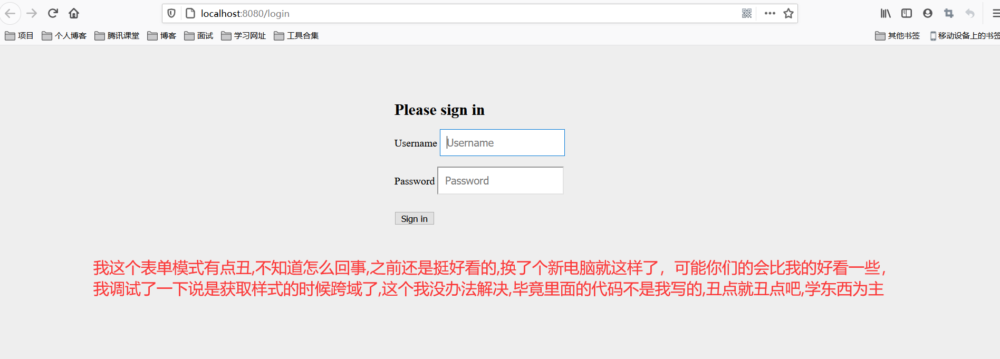

也可以通过application.yml指定配置用户名密码

```yaml
spring:
    security:
      user:
        name: xiaoge
        password: xiaoge
```

# 详解formLogin模式登录认证

## 什么是formLogin模式

通俗易懂的理解就是我们可以自定义我们的登录表单,而不是使用SpringSecurity帮我们指定的登录页面

## 实现方式

我们还是在原来代码的基础上进行修改，把刚刚注释掉的`@Configuration`打开

注释掉之前写的HttpBasic登录模式的代码，修改成如下代码

```java
@Configuration
public class WebSecurityConfig extends WebSecurityConfigurerAdapter {

    @Override
    protected void configure(AuthenticationManagerBuilder auth) throws Exception {
        super.configure(auth);
    }

    @Override
    public void configure(WebSecurity web) throws Exception {
        super.configure(web);
    }

    @Override
    protected void configure(HttpSecurity http) throws Exception {
        /*//开启httpBasic认证
        http.httpBasic()
                .and()
                .authorizeRequests()
                .anyRequest()
                //所有请求都需要登录认证才能访问
                .authenticated();*/

        http.authorizeRequests()
                //需要放行的url在这里配置,必须要放行/login和/login.html,不然会报错
                .antMatchers("/login","/login.html").permitAll()
                .anyRequest()
                .authenticated()
                .and()
                // 设置登陆页
                .formLogin().loginPage("/login.html")
                //登录表单form中action的地址，也就是处理认证请求的路径
                .loginProcessingUrl("/login")
                //登录表单form中用户名输入框input的name名，不修改的话默认是username
                .usernameParameter("username")
                //登录表单form中密码输入框input的name名，不修改的话默认是password
                .passwordParameter("password")
                //登录认证成功后默认转跳的路径
                .defaultSuccessUrl("/home");

        //关闭CSRF跨域
        //详解什么是CSRF:https://www.cnblogs.com/pengdai/p/12164754.html
        http.csrf().disable();
    }
}
```


访问： http://localhost:8080/login.html 进行测试,你会发现登录成功之后所有的链接都是可以访问的,接下来我们需要配置权限

## 静态权限配置

我们一步一步来,先实现静态权限,然后弄懂原理之后我们再一步步实现动态权限，继续修改代码

```java
package com.xiaoge.auth;

import org.springframework.context.annotation.Configuration;
import org.springframework.security.config.annotation.authentication.builders.AuthenticationManagerBuilder;
import org.springframework.security.config.annotation.web.builders.HttpSecurity;
import org.springframework.security.config.annotation.web.builders.WebSecurity;
import org.springframework.security.config.annotation.web.configuration.WebSecurityConfigurerAdapter;

@Configuration
public class WebSecurityConfig extends WebSecurityConfigurerAdapter {

    @Override
    protected void configure(AuthenticationManagerBuilder auth) throws Exception {
        super.configure(auth);
    }

    @Override
    public void configure(WebSecurity web) throws Exception {
        super.configure(web);
    }

    @Override
    protected void configure(HttpSecurity http) throws Exception {
        /*//开启httpBasic认证
        http.httpBasic()
                .and()
                .authorizeRequests()
                .anyRequest()
                //所有请求都需要登录认证才能访问
                .authenticated();*/

        http.authorizeRequests()
                //需要放行的url在这里配置,必须要放行/login和/login.html,不然会报错
                .antMatchers("/login","/login.html").permitAll()
                //访问/users和/roles必须要有user和admin权限
                .antMatchers("/users","/roles")
                //.hasAuthority("ROLE_user")
                .hasAnyAuthority("ROLE_user","ROLE_admin")
                .antMatchers("/menus","/others")
                //.hasRole("admin")
                .hasAnyRole("admin")
                .anyRequest()
                .authenticated()
                .and()
                // 设置登陆页
                .formLogin().loginPage("/login.html")
                //登录表单form中action的地址，也就是处理认证请求的路径
                .loginProcessingUrl("/login")
                //登录表单form中用户名输入框input的name名，不修改的话默认是username
                .usernameParameter("username")
                //登录表单form中密码输入框input的name名，不修改的话默认是password
                .passwordParameter("password")
                //登录认证成功后默认转跳的路径
                .defaultSuccessUrl("/home");

        //关闭CSRF跨域
        //详解什么是CSRF:https://www.cnblogs.com/pengdai/p/12164754.html
        http.csrf().disable();
    }
}
```

配置完成运行之后发现所有的超链接都会出现403禁止访问的错误,什么原因呢?其实就是我们没有配置用户名和密码,接下来需要配置登录的用户名和密码了,但是在配置之前我们先讲一下SpringSecurity给我们提供的密码加密模式

## PasswordEncoder密码加密

Spring Security封装了如bcrypt, PBKDF2, scrypt, Argon2等主流适应性单向加密方法（ adaptive one-way functions），用以进行密码存储和校验。单向校验安全性高，但开销很大，单次密码校验耗时可能高达1秒，故针对高并发性能要求较强的大型信息系统，SpringSecurity更推荐选择如：session, OAuth，Token等开销很小的短期加密策略（short term credential）实现系统信息安全。

PasswordEncoder 是Spring Scurity框架内处理密码加密与校验的接口。

```java
package org.springframework.security.crypto.password;

public interface PasswordEncoder {
   String encode(CharSequence rawPassword);

   boolean matches(CharSequence rawPassword, String encodedPassword);

   default boolean upgradeEncoding(String encodedPassword) {
      return false;
   }
}
```

这个接口有三个方法

- encode方法接受的参数是原始密码字符串，返回值是经过加密之后的hash值，hash值是不能被逆向解密的。这个方法通常在为系统添加用户，或者用户注册的时候使用。
- matches方法是用来校验用户输入密码rawPassword，和加密后的hash值encodedPassword是否匹配。如果能够匹配返回true，表示用户输入的密码rawPassword是正确的，反之返回fasle。也就是说虽然这个hash值不能被逆向解密，但是可以判断是否和原始密码匹配。这个方法通常在用户登录的时候进行用户输入密码的正确性校验。
- upgradeEncoding设计的用意是，判断当前的密码是否需要升级。也就是是否需要重新加密？需要的话返回true，不需要的话返回fasle。默认实现是返回false。

==使用方式==

```java
package com.xiaoge;

import org.junit.jupiter.api.Test;
import org.springframework.beans.factory.annotation.Autowired;
import org.springframework.boot.test.context.SpringBootTest;
import org.springframework.security.crypto.bcrypt.BCrypt;
import org.springframework.security.crypto.password.PasswordEncoder;

@SpringBootTest
class SpringbootSecurityApplicationTests {

    @Autowired
    private PasswordEncoder passwordEncoder;

    @Test
    void contextLoads() {

        //对密码进行加密
        String encode1 = passwordEncoder.encode("123");
        String encode2 = passwordEncoder.encode("123");

        //加密之后的密码
        System.out.println(encode1);
        System.out.println(encode2);

        //可以通过这段代码随机生成盐值
        System.out.println(BCrypt.gensalt());

        //能否匹配原始密码
        boolean matches1 = passwordEncoder.matches("123", encode1);
        boolean matches2 = passwordEncoder.matches("123", encode2);

        //打印匹配的结果
        System.out.println(matches1);
        System.out.println(matches2);

    }
}
```

==结果==

```:busts_in_silhouette:
$2a$10$NPreS1zn3BENBppW0YmyJ.vyKLDjeyLk801ioTKxX.lebjhQqmQTW
$2a$10$7wZNaGf2fkgR3ZCJrH1JmO5vuzaSmEphBjWsiX0CWw6jdaed96p.K
true
true
```

使用加密的方式在内存中配置用户名和密码,修改类`WebSecurityConfig`

```java
package com.xiaoge.auth;

import org.springframework.beans.factory.annotation.Autowired;
import org.springframework.context.annotation.Bean;
import org.springframework.context.annotation.Configuration;
import org.springframework.security.config.annotation.authentication.builders.AuthenticationManagerBuilder;
import org.springframework.security.config.annotation.web.builders.HttpSecurity;
import org.springframework.security.config.annotation.web.builders.WebSecurity;
import org.springframework.security.config.annotation.web.configuration.WebSecurityConfigurerAdapter;
import org.springframework.security.core.userdetails.UserDetailsService;
import org.springframework.security.crypto.bcrypt.BCryptPasswordEncoder;
import org.springframework.security.crypto.password.PasswordEncoder;

@Configuration
public class WebSecurityConfig extends WebSecurityConfigurerAdapter {

    @Bean
    public PasswordEncoder passwordEncoder(){
        return new BCryptPasswordEncoder();
    }

    @Autowired
    private PasswordEncoder passwordEncoder;

    @Autowired
    private UserDetailsService userDetailsService;

    @Override
    protected void configure(AuthenticationManagerBuilder auth) throws Exception {
        //在内存中配置用户名和密码
        auth.inMemoryAuthentication()
                .withUser("user")
                .password(passwordEncoder().encode("123"))
                .roles("user")
                .and()
                .withUser("admin")
                .password(passwordEncoder().encode("123"))
            	//.authorities("user:add","user:update")
                .roles("admin")
                .and()
                .passwordEncoder(passwordEncoder());//配置BCrypt加密
    }

    @Override
    public void configure(WebSecurity web) throws Exception {
        super.configure(web);
    }

    @Override
    protected void configure(HttpSecurity http) throws Exception {
        /*//开启httpBasic认证
        http.httpBasic()
                .and()
                .authorizeRequests()
                .anyRequest()
                //所有请求都需要登录认证才能访问
                .authenticated();*/

        http.authorizeRequests()
                //需要放行的url在这里配置,必须要放行/login和/login.html,不然会报错
                .antMatchers("/login","/login.html").permitAll()
                //
                .antMatchers("/users","/roles")
                //.hasAuthority("ROLE_user")
                .hasAnyAuthority("ROLE_user","ROLE_admin")
                .antMatchers("/menus","/others")
                //.hasRole("admin")
                .hasAnyRole("admin")
                .anyRequest()
                .authenticated()
                .and()
                // 设置登陆页
                .formLogin().loginPage("/login.html")
                //登录表单form中action的地址，也就是处理认证请求的路径
                .loginProcessingUrl("/login")
                //登录表单form中用户名输入框input的name名，不修改的话默认是username
                .usernameParameter("username")
                //登录表单form中密码输入框input的name名，不修改的话默认是password
                .passwordParameter("password")
                //登录认证成功后默认转跳的路径
                .defaultSuccessUrl("/home");

        //关闭CSRF跨域
        //详解什么是CSRF:https://www.cnblogs.com/pengdai/p/12164754.html
        http.csrf().disable();
    }
}
```

- `inMemoryAuthentication`指的是在内存里面存储用户的身份认证和授权信息。
- `withUser("user")`用户名是user
- `password(passwordEncoder().encode("123"))`密码是加密之后的123
- `.authorities("user:add","user:update")`指的是admin用户拥有资源ID对应的资源访问的的权限：用户添加和修改
- `roles()`方法用于指定用户的角色，一个用户可以有多个角色

添加完之后启动项目进行测试,发现可以使用user和admin进行登录,并且登录看到的效果是不一样的

# 数据库中读取用户信息

刚刚我们写的用户和权限都是定死的,并不是动态权限以及数据,接下来我们实现如何从数据库中获取数据,继续改造代码

## 创建数据库

一般权限控制有三层，即：`用户`<–>`角色`<–>`权限`，用户与角色是多对多，角色和权限也是多对多。这里我们先暂时不考虑权限，只考虑`用户`<–>`角色`。

创建用户表`sys_user`：

```sql
-- ----------------------------
-- Table structure for sys_user
-- ----------------------------
DROP TABLE IF EXISTS `sys_user`;
CREATE TABLE `sys_user`  (
  `id` int(11) NOT NULL AUTO_INCREMENT,
  `username` varchar(255) CHARACTER SET utf8 COLLATE utf8_general_ci NOT NULL,
  `password` varchar(255) CHARACTER SET utf8 COLLATE utf8_general_ci NOT NULL,
  PRIMARY KEY (`id`) USING BTREE
) ENGINE = InnoDB CHARACTER SET = utf8 COLLATE = utf8_general_ci ROW_FORMAT = Dynamic;
```

创建角色表`sys_role`：

```sql
-- ----------------------------
-- Table structure for sys_role
-- ----------------------------
DROP TABLE IF EXISTS `sys_role`;
CREATE TABLE `sys_role`  (
  `id` int(11) NOT NULL,
  `code` varchar(255) CHARACTER SET utf8 COLLATE utf8_general_ci NOT NULL,
  `name` varchar(255) CHARACTER SET utf8 COLLATE utf8_general_ci NULL DEFAULT NULL,
  PRIMARY KEY (`id`) USING BTREE
) ENGINE = InnoDB CHARACTER SET = utf8 COLLATE = utf8_general_ci ROW_FORMAT = Dynamic;
```

创建用户-角色表`sys_user_role`：

```sql
-- ----------------------------
-- Table structure for sys_user_role
-- ----------------------------
DROP TABLE IF EXISTS `sys_user_role`;
CREATE TABLE `sys_user_role`  (
  `user_id` int(11) NOT NULL,
  `role_id` int(11) NOT NULL,
  PRIMARY KEY (`user_id`, `role_id`) USING BTREE,
  INDEX `fk_role_id`(`role_id`) USING BTREE,
  CONSTRAINT `fk_role_id` FOREIGN KEY (`role_id`) REFERENCES `sys_role` (`id`) ON DELETE CASCADE ON UPDATE CASCADE,
  CONSTRAINT `fk_user_id` FOREIGN KEY (`user_id`) REFERENCES `sys_user` (`id`) ON DELETE CASCADE ON UPDATE CASCADE
) ENGINE = InnoDB CHARACTER SET = utf8 COLLATE = utf8_general_ci ROW_FORMAT = Dynamic;
```

初始化一下数据：

```sql
-- ----------------------------
-- Records of sys_user
-- ----------------------------
INSERT INTO `sys_user` VALUES (1, 'xiaoge', '$2a$10$NPreS1zn3BENBppW0YmyJ.vyKLDjeyLk801ioTKxX.lebjhQqmQTW');
INSERT INTO `sys_user` VALUES (2, 'ange', '$2a$10$7wZNaGf2fkgR3ZCJrH1JmO5vuzaSmEphBjWsiX0CWw6jdaed96p.K');

-- ----------------------------
-- Records of sys_role
-- ----------------------------
INSERT INTO `sys_role` VALUES (1, 'ROLE_admin', '超级管理员');
INSERT INTO `sys_role` VALUES (2, 'ROLE_user', '普通用户');

-- ----------------------------
-- Records of sys_user_role
-- ----------------------------
INSERT INTO `sys_user_role` VALUES (1, 1);
INSERT INTO `sys_user_role` VALUES (2, 2);
```

> 这里的权限格式为`ROLE_XXX`，是Spring Security规定的，不要乱起名字哦。

## 导入依赖

因为这里使用MyBatis或者MyBatis-Plus实现,还需要用到MyBatis-Plus的代码自动生成器,所以这里导入一些需要的依赖

```xml
<!--mysql连接java的依赖-->
<dependency>
    <groupId>mysql</groupId>
    <artifactId>mysql-connector-java</artifactId>
    <version>8.0.13</version>
</dependency>

<!--swagger的依赖-->
<dependency>
    <groupId>io.springfox</groupId>
    <artifactId>springfox-swagger-ui</artifactId>
    <version>2.7.0</version>
</dependency>

<dependency>
    <groupId>io.springfox</groupId>
    <artifactId>springfox-swagger2</artifactId>
    <version>2.7.0</version>
</dependency>

<!--MyBatis-Plus的依赖-->
<dependency>
    <groupId>com.baomidou</groupId>
    <artifactId>mybatis-plus-boot-starter</artifactId>
    <version>3.4.1</version>
</dependency>

<!--代码自动生成器-->
<dependency>
    <groupId>com.baomidou</groupId>
    <artifactId>mybatis-plus-generator</artifactId>
    <version>3.4.1</version>
</dependency>

<!--添加 模板引擎 依赖，MyBatis-Plus 支持 Velocity（默认）-->
<dependency>
    <groupId>org.apache.velocity</groupId>
    <artifactId>velocity-engine-core</artifactId>
    <version>2.2</version>
</dependency>

<!--hutool工具类-->
<dependency>
    <groupId>cn.hutool</groupId>
    <artifactId>hutool-all</artifactId>
    <version>5.5.8</version>
</dependency>
```

## 代码生成器

```java
package com.xiaoge;

import com.baomidou.mybatisplus.annotation.DbType;
import com.baomidou.mybatisplus.annotation.IdType;
import com.baomidou.mybatisplus.core.exceptions.MybatisPlusException;
import com.baomidou.mybatisplus.generator.AutoGenerator;
import com.baomidou.mybatisplus.generator.config.*;
import com.baomidou.mybatisplus.generator.config.rules.DateType;
import com.baomidou.mybatisplus.generator.config.rules.NamingStrategy;
import org.apache.commons.lang3.StringUtils;

import java.util.Scanner;

public class CodeGenerator {

    /**
     * <p>
     * 读取控制台内容
     * </p>
     */
    public static String scanner(String tip) {
        Scanner scanner = new Scanner(System.in);
        StringBuilder help = new StringBuilder();
        help.append("请输入" + tip + "：");
        System.out.println(help.toString());
        if (scanner.hasNext()) {
            String ipt = scanner.next();
            if (StringUtils.isNotEmpty(ipt)) {
                return ipt;
            }
        }
        throw new MybatisPlusException("请输入正确的" + tip + "！");
    }

    public static void main(String[] args) {
        // 创建代码生成器对象
        AutoGenerator mpg = new AutoGenerator();

        // 全局配置
        GlobalConfig gc = new GlobalConfig();
        gc.setOutputDir(scanner("请输入你的项目路径") + "/src/main/java");
        gc.setAuthor("xiaoge");
        //生成之后是否打开资源管理器
        gc.setOpen(false);
        //重新生成时是否覆盖文件
        gc.setFileOverride(false);
        //%s 为占位符
        //mp生成service层代码,默认接口名称第一个字母是有I
        gc.setServiceName("%sService");
        //设置主键生成策略  自动增长
        gc.setIdType(IdType.AUTO);
        //设置Date的类型   只使用 java.util.date 代替
        gc.setDateType(DateType.ONLY_DATE);
        //开启实体属性 Swagger2 注解
        gc.setSwagger2(true);
        mpg.setGlobalConfig(gc);

        // 数据源配置
        DataSourceConfig dsc = new DataSourceConfig();
        dsc.setUrl("jdbc:mysql://localhost:3306/security?useUnicode=true&characterEncoding=UTF-8&serverTimezone=GMT%2B8");
        dsc.setDriverName("com.mysql.cj.jdbc.Driver");
        dsc.setUsername("root");
        dsc.setPassword("root");
        //使用mysql数据库
        dsc.setDbType(DbType.MYSQL);
        mpg.setDataSource(dsc);

        // 包配置
        PackageConfig pc = new PackageConfig();
        //pc.setModuleName(scanner("请输入模块名"));
        pc.setParent("com.xiaoge");
        pc.setController("controller");
        pc.setService("service");
        pc.setServiceImpl("service.impl");
        pc.setMapper("mapper");
        pc.setEntity("entity");
        pc.setXml("mapper");
        mpg.setPackageInfo(pc);

        // 策略配置
        StrategyConfig strategy = new StrategyConfig();
        //设置哪些表需要自动生成
        strategy.setInclude(scanner("表名，多个英文逗号分割").split(","));

        //实体类名称驼峰命名
        strategy.setNaming(NamingStrategy.underline_to_camel);

        //列名名称驼峰命名
        strategy.setColumnNaming(NamingStrategy.underline_to_camel);
        //使用简化getter和setter
        strategy.setEntityLombokModel(true);
        //设置controller的api风格  使用RestController
        strategy.setRestControllerStyle(true);
        //驼峰转连字符
        strategy.setControllerMappingHyphenStyle(true);
        //忽略表中生成实体类的前缀
        //strategy.setTablePrefix("t_");
        mpg.setStrategy(strategy);
        mpg.execute();
    }
}
```

## 配置application.yml

```yaml
spring:
  datasource:
    driver-class-name: com.mysql.cj.jdbc.Driver
    url: jdbc:mysql://localhost:3306/security?useUnicode=true&characterEncoding=UTF-8&serverTimezone=GMT%2B8
    username: root
    password: root

mybatis-plus:
  mapper-locations: classpath*:/mapper/*Mapper.xml
  configuration:
    log-impl: org.apache.ibatis.logging.stdout.StdOutImpl
  type-aliases-package: com.xiaoge.entity
```

## 配置SpringSecurity

首先我们需要自定义 `UserDetailsService` ，将用户信息和权限注入进来。

我们需要重写 `loadUserByUsername` 方法，参数是用户输入的用户名。返回值是`UserDetails`，这是一个接口，一般使用它的子类`org.springframework.security.core.userdetails.User`，它有三个参数，分别是用户名、密码和权限集。

> 实际情况下，大多将 DAO 中的 User 类继承 `org.springframework.security.core.userdetails.User` 返回。

添加类`UserDetailsServiceImpl`

```java
package com.xiaoge.service.impl;

import cn.hutool.core.util.StrUtil;
import com.baomidou.mybatisplus.core.conditions.query.LambdaQueryWrapper;
import com.xiaoge.entity.SysUser;
import com.xiaoge.mapper.SysUserMapper;
import org.springframework.beans.factory.annotation.Autowired;
import org.springframework.security.core.GrantedAuthority;
import org.springframework.security.core.authority.SimpleGrantedAuthority;
import org.springframework.security.core.userdetails.User;
import org.springframework.security.core.userdetails.UserDetails;
import org.springframework.security.core.userdetails.UserDetailsService;
import org.springframework.security.core.userdetails.UsernameNotFoundException;
import org.springframework.stereotype.Service;

import java.util.ArrayList;
import java.util.List;

@Service(value = "userDetailsService")
public class UserDetailsServiceImpl implements UserDetailsService {
    @Autowired
    private SysUserMapper sysUserMapper;

    @Override
    public UserDetails loadUserByUsername(String username) throws UsernameNotFoundException {
        //判断非空
        if(StrUtil.isEmpty(username)){
            throw new RuntimeException("用户名不能为空");
        }
        //如果不为空,则从数据库中通过用户名获取对应的用户信息
        LambdaQueryWrapper<SysUser> wrapper = new LambdaQueryWrapper<>();
        wrapper.eq(SysUser::getUsername,username);
        SysUser sysUser = sysUserMapper.selectOne(wrapper);
        if(sysUser==null){
            throw new UsernameNotFoundException(String.format("%s这个用户不存在",username));
        }
        //如果用户存在则要查询用户的角色集合
        List<GrantedAuthority> authorities = new ArrayList<>();
        List<String> codeList= sysUserMapper.getRoleCodeByUserName(username);
        codeList.forEach(code->{
            //如果数据库中没有添加ROLE_则这里需要添加一个
            //SimpleGrantedAuthority authority = new SimpleGrantedAuthority("ROLE_"+code);
            SimpleGrantedAuthority authority = new SimpleGrantedAuthority(code);
            authorities.add(authority);
        });
        return new User(sysUser.getUsername(),sysUser.getPassword(),authorities);
    }
}
```

修改类`WebSecurityConfig`

```java
package com.xiaoge.auth;

import org.springframework.beans.factory.annotation.Autowired;
import org.springframework.context.annotation.Bean;
import org.springframework.context.annotation.Configuration;
import org.springframework.security.config.annotation.authentication.builders.AuthenticationManagerBuilder;
import org.springframework.security.config.annotation.web.builders.HttpSecurity;
import org.springframework.security.config.annotation.web.builders.WebSecurity;
import org.springframework.security.config.annotation.web.configuration.WebSecurityConfigurerAdapter;
import org.springframework.security.core.userdetails.UserDetailsService;
import org.springframework.security.crypto.bcrypt.BCryptPasswordEncoder;
import org.springframework.security.crypto.password.PasswordEncoder;

@Configuration
public class WebSecurityConfig extends WebSecurityConfigurerAdapter {

    @Bean
    public PasswordEncoder passwordEncoder(){
        return new BCryptPasswordEncoder();
    }

    @Autowired
    private PasswordEncoder passwordEncoder;

    @Autowired
    private UserDetailsService userDetailsService;

    @Override
    protected void configure(AuthenticationManagerBuilder auth) throws Exception {
        /*//在内存中配置用户名和密码
        auth.inMemoryAuthentication()
                .withUser("user")
                .password(passwordEncoder().encode("123"))
                .roles("user")
                .and()
                .withUser("admin")
                .password(passwordEncoder().encode("123"))
                .roles("admin")
                .and()
                .passwordEncoder(passwordEncoder());//配置BCrypt加密*/

        auth.userDetailsService(userDetailsService)
                .passwordEncoder(passwordEncoder);
    }

    @Override
    public void configure(WebSecurity web) throws Exception {
        super.configure(web);
    }

    @Override
    protected void configure(HttpSecurity http) throws Exception {
        /*//开启httpBasic认证
        http.httpBasic()
                .and()
                .authorizeRequests()
                .anyRequest()
                //所有请求都需要登录认证才能访问
                .authenticated();*/

        http.authorizeRequests()
                //需要放行的url在这里配置,必须要放行/login和/login.html,不然会报错
                .antMatchers("/login","/login.html").permitAll()
                //
                .antMatchers("/users","/roles")
                //.hasAuthority("ROLE_user")
                .hasAnyAuthority("ROLE_user","ROLE_admin")
                .antMatchers("/menus","/others")
                //.hasRole("admin")
                .hasAnyRole("admin")
                .anyRequest()
                .authenticated()
                .and()
                // 设置登陆页
                .formLogin().loginPage("/login.html")
                //登录表单form中action的地址，也就是处理认证请求的路径
                .loginProcessingUrl("/login")
                //登录表单form中用户名输入框input的name名，不修改的话默认是username
                .usernameParameter("username")
                //登录表单form中密码输入框input的name名，不修改的话默认是password
                .passwordParameter("password")
                //登录认证成功后默认转跳的路径
                .defaultSuccessUrl("/home");

        //关闭CSRF跨域
        //详解什么是CSRF:https://www.cnblogs.com/pengdai/p/12164754.html
        http.csrf().disable();
    }
}
```

配置完成后通过数据库的用户名和密码确实能够实现登录了,这里我们动态的用户登录已经实现了

## 基本原理

当浏览器发起表单登录请求时，当通过 `UsernamePasswordAuthenticationFilter` 进行认证，认证成功后，如果有记住我的功能，其实还会经过 `RememberMeService`，在其中有个 `TokenRepository`，它会生成一个 token，首先将 token 写入到浏览器的 Cookie 中，然后将 token、认证成功的用户名写入到数据库中。

当浏览器下次请求时，会经过 `RememberMeAuthenticationFilter`，它会读取 Cookie 中的 token，交给 RememberMeService 从数据库中查询记录。如果存在记录，会读取用户名并去调用 `UserDetailsService`，获取用户信息，并将用户信息放入Spring Security 中，实现自动登陆。


RememberMeAuthenticationFilter 在整个过滤器链中是比较靠后的位置，也就是说在传统登录方式都无法登录的情况下才会使用自动登陆。


这里不考虑记住我的功能,因为后面我们会通过JWT中生成的token去实现的,这里只要大家理解登录的时候经过了`UsernamePasswordAuthenticationFilter`这个过滤器就行了

# 异常处理

不知道你有没有注意到，当我们登陆失败时候，Spring security 帮我们跳转到了 `/login?error` Url，奇怪的是不管是控制台还是网页上都没有打印错误信息。

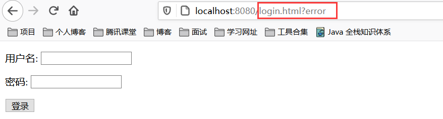

这是因为首先 `/login?error` 是 Spring security 默认的失败 Url，其次**如果你不手动处理这个异常，这个异常是不会被处理的**。

## 常见异常

我们先来列举下一些 Spring Security 中常见的异常：

- `UsernameNotFoundException`（用户不存在）
- `DisabledException`（用户已被禁用）
- `BadCredentialsException`（坏的凭据）
- `LockedException`（账户锁定）
- `AccountExpiredException` （账户过期）
- `CredentialsExpiredException`（证书过期）
- …

以上列出的这些异常都是 `AuthenticationException` 的子类，然后我们来看看 Spring security 如何处理`AuthenticationException` 异常的。

## 源码分析

我们知道异常处理一般在过滤器中处理，我们在 `AbstractAuthenticationProcessingFilter` 中找到了对 `AuthenticationException` 的处理：

（1）在 `doFilter()` 中，捕捉了 `AuthenticationException` 异常，并交给了 `unsuccessfulAuthentication()` 处理。


（2）在 `unsuccessfulAuthentication()` 中，转交给了 `SimpleUrlAuthenticationFailureHandler` 类的 `onAuthenticationFailure()` 处理。


（3）在`onAuthenticationFailure()`中，首先判断有没有设置`defaultFailureUrl`。

- 如果没有设置，直接返回 401 错误，即 `HttpStatus.UNAUTHORIZED` 的值。
- 如果设置了，首先执行 `saveException()` 方法。然后判断 `forwardToDestination` ，即是否是服务器跳转，默认使用重定向即客户端跳转。

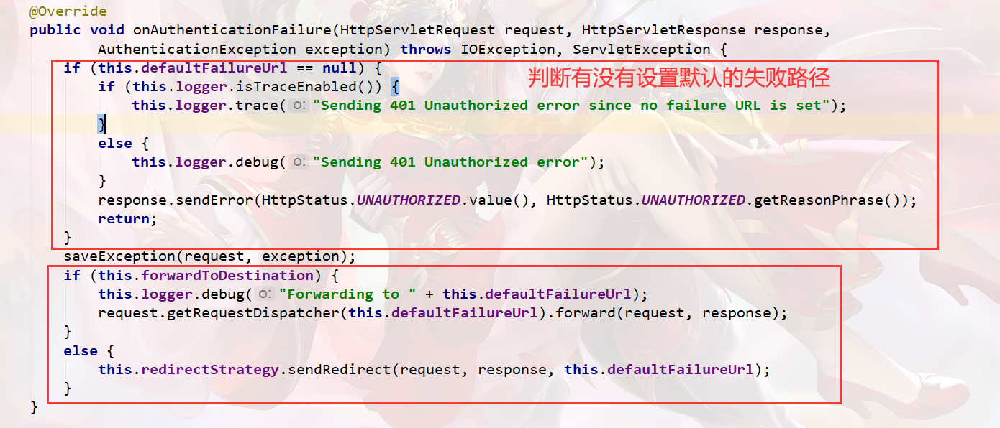

（4）在 `saveException()` 方法中，首先判断`forwardToDestination`，如果使用服务器跳转则写入 Request，客户端跳转则写入 Session。写入名为 `SPRING_SECURITY_LAST_EXCEPTION` ，值为 `AuthenticationException`。

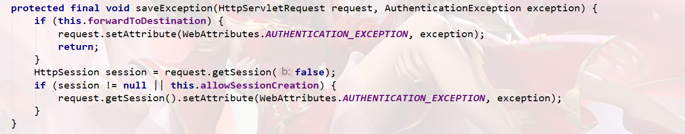


至此 Spring security 完成了异常处理，总结一下流程：

–> AbstractAuthenticationProcessingFilter`.doFilter()`

–> AbstractAuthenticationProcessingFilter.`unsuccessfulAuthentication()`

–> SimpleUrlAuthenticationFailureHandler.`onAuthenticationFailure()`

–> SimpleUrlAuthenticationFailureHandler.`saveException()`

## 处理异常

上面源码说了那么多，真正处理起来很简单，我们只需要指定错误的url，然后再该方法中对异常进行处理即可。

（1）指定错误Url，`WebSecurityConfig`中添加`.failureUrl("/login/error")`

```java
@Override
protected void configure(HttpSecurity http) throws Exception {
    /*//开启httpBasic认证
    http.httpBasic()
            .and()
            .authorizeRequests()
            .anyRequest()
            //所有请求都需要登录认证才能访问
            .authenticated();*/

    http.authorizeRequests()
            //需要放行的url在这里配置,必须要放行/login和/login.html,不然会报错
            .antMatchers("/login","/login.html").permitAll()
            //
            .antMatchers("/users","/roles")
            //.hasAuthority("ROLE_user")
            .hasAnyAuthority("ROLE_user","ROLE_admin")
            .antMatchers("/menus","/others")
            //.hasRole("admin")
            .hasAnyRole("admin")
            .anyRequest()
            .authenticated()
            .and()
            // 设置登陆页
            .formLogin().loginPage("/login.html")
            //登录表单form中action的地址，也就是处理认证请求的路径
            .loginProcessingUrl("/login")
            //登录表单form中用户名输入框input的name名，不修改的话默认是username
            .usernameParameter("username")
            //登录表单form中密码输入框input的name名，不修改的话默认是password
            .passwordParameter("password")
            //登录认证成功后默认转跳的路径  注意这里不要忘记加permitAll()
            .defaultSuccessUrl("/home").permitAll()
            // 登录失败Url
            .failureUrl("/login/error");

    //关闭CSRF跨域
    //详解什么是CSRF:https://www.cnblogs.com/pengdai/p/12164754.html
    http.csrf().disable();
}
```

（2）在Controller中处理异常

```java
@RequestMapping("/login/error")
public void loginError(HttpServletRequest request, HttpServletResponse response) {
    response.setContentType("text/html;charset=utf-8");
    AuthenticationException exception =
            (AuthenticationException)request.getSession().getAttribute("SPRING_SECURITY_LAST_EXCEPTION");
    try {
        response.getWriter().write(exception.toString());
    }catch (IOException e) {
        e.printStackTrace();
    }
}
```

我们首先获取了 session 中的 `SPRING_SECURITY_LAST_EXCEPTION` 。为了演示，我只是简单的将错误信息返回给了页面。运行程序，当我们输入错误密码时：


其实我们也能去判断用户名是否错误,这里不做演示，大家可以参考:https://blog.csdn.net/wzl19870309/article/details/70314085

# 前后端分离处理方案

==屏蔽Spring Security默认重定向登录页面以实现前后端分离功能==

接下来需要实现权限部分吗?当然还不是,我们先从前后端分离的解决方案入手

在我之前的文章中，做过登录验证流程的源码解析。其中比较重要的就是


- 当我们登录成功的时候，是由AuthenticationSuccessHandler进行登录结果处理，默认跳转到defaultSuccessUrl配置的路径对应的资源页面（这里是home.html）。
- 当我们登录失败的时候，是由AuthenticationfailureHandler进行登录结果处理，默认跳转到failureUrl配置的路径对应的资源页面（一般也是跳转登录页login.html，重新登录）。

但是在web应用开发过程中需求是千变万化的，有时需要我们针对登录结果做个性化处理，比如：

- 我们希望不同的人登陆之后，看到不同的首页（及向不同的路径跳转）
- 我们应用是前后端分离的，验证响应结果是JSON格式数据，而不是页面跳转
- …… 其他未尽的例子

以上的这些情况，使用Spring Security作为安全框架的时候，都需要我们进行自定义的登录验证结果处理。

## 自定义登录成功处理方案


从代码中可以看出,登录成功之后我们是跳转到`/home`控制器的,也就是跳转到`home.html`

但是在前后端分离的情况下，页面的跳转是交给前端去控制的,后端的控制器就不生效了,那我们应该如何实现让前端去跳转页面呢?

其实也很简单,我们只需要返回给前端一个特定的信号,这个信号可以是一个字符串,也可以是一个数字,当然,我们为了让我们的项目更加贴合实际的开发,我们返回一个封装的类Result,具体内容如下:

`Result`

```java
import io.swagger.annotations.ApiModelProperty;
import lombok.Data;

import java.util.HashMap;
import java.util.Map;

/**
 * @author NieChangan
 * @Description 公共结果返回
 */
@Data
public class Result {
    @ApiModelProperty(value = "是否成功")
    private Boolean success;

    @ApiModelProperty(value = "返回码")
    private Integer code;

    @ApiModelProperty(value = "返回消息")
    private String message;

    @ApiModelProperty(value = "返回数据")
    private Map<String,Object> data = new HashMap<>();

    /**
     * 构造方法私有化,里面的方法都是静态方法
     * 达到保护属性的作用
     */
    private Result(){

    }

    /**
     * 这里是使用链式编程
     */
    public static Result ok(){
        Result result = new Result();
        result.setSuccess(true);
        result.setCode(ResultCode.SUCCESS.getCode());
        result.setMessage(ResultCode.SUCCESS.getMessage());
        return result;
    }

    public static Result error(){
        Result result = new Result();
        result.setSuccess(false);
        result.setCode(ResultCode.COMMON_FAIL.getCode());
        result.setMessage(ResultCode.COMMON_FAIL.getMessage());
        return result;
    }

    public static Result error(ResultCode resultCode){
        Result result = new Result();
        result.setSuccess(false);
        result.setCode(resultCode.getCode());
        result.setMessage(resultCode.getMessage());
        return result;
    }

    /**
     * 自定义返回成功与否
     * @param success
     * @return
     */
    public Result success(Boolean success){
        this.setSuccess(success);
        return this;
    }

    public Result message(String message){
        this.setMessage(message);
        return this;
    }

    public Result code(Integer code){
        this.setCode(code);
        return this;
    }

    public Result data(String key,Object value){
        this.data.put(key,value);
        return this;
    }

    public Result data(Map<String,Object> map){
        this.setData(map);
        return this;
    }
}
```

`ResultCode`

```java
/**
 * @author xiaoge
 * @Description 枚举这个就类似静态类,目的是指定返回的规范
 * 规定:
 * #200表示成功
 * #1001～1999 区间表示参数错误
 * #2001～2999 区间表示用户错误
 * #3001～3999 区间表示接口异常
 * #4001～4999 区间表示业务错误
 * #5001～5999 区间表示部门错误
 * #9001～9999 区间表示运行时异常
 * #后面对什么的操作自己在这里注明就行了
 */
public enum ResultCode implements CustomizeResultCode{

    /* 成功 */
    SUCCESS(200, "成功"),

    /* 默认失败 */
    COMMON_FAIL(999, "失败"),

    /* 参数错误：1000～1999 */
    PARAM_NOT_VALID(1001, "参数无效"),
    PARAM_IS_BLANK(1002, "参数为空"),
    PARAM_TYPE_ERROR(1003, "参数类型错误"),
    PARAM_NOT_COMPLETE(1004, "参数缺失"),

    /* 用户错误 */
    USER_NOT_LOGIN(2001, "用户未登录"),
    USER_ACCOUNT_EXPIRED(2002, "账号已过期"),
    USER_CREDENTIALS_ERROR(2003, "密码错误"),
    USER_CREDENTIALS_EXPIRED(2004, "密码过期"),
    USER_ACCOUNT_DISABLE(2005, "账号不可用"),
    USER_ACCOUNT_LOCKED(2006, "账号被锁定"),
    USER_ACCOUNT_NOT_EXIST(2007, "账号不存在"),
    USER_ACCOUNT_ALREADY_EXIST(2008, "账号已存在"),
    USER_ACCOUNT_USE_BY_OTHERS(2009, "您的登录已经超时或者已经在另一台机器登录，您被迫下线"),

    /* 业务错误 */
    NO_PERMISSION(4001, "没有权限"),

    /*部门错误*/
    DEPARTMENT_NOT_EXIST(5007, "部门不存在"),
    DEPARTMENT_ALREADY_EXIST(5008, "部门已存在"),

    /*运行时异常*/
    ARITHMETIC_EXCEPTION(9001,"算数异常"),
    NULL_POINTER_EXCEPTION(9002,"空指针异常"),
    ARRAY_INDEX_OUTOfBOUNDS_EXCEPTION(9003,"数组越界");

    private Integer code;

    private String message;

    ResultCode(Integer code,String message){
        this.code = code;
        this.message = message;
    }

    @Override
    public Integer getCode() {
        return code;
    }

    @Override
    public String getMessage() {
        return message;
    }
}
```

这个类定义了一些特定的错误信息,这些错误信息可以自行添加

`CustomizeResultCode`

```java
/**
 * @author NieChangan
 * @Description 自定义错误信息接口
 */
public interface CustomizeResultCode {

    /**
     * 获取错误状态码
     * @return 错误状态码
     */
    Integer getCode();

    /**
     * 获取错误信息
     * @return 错误信息
     */
    String getMessage();
}
```

前后端分离的情况下我们只需要将`Result`类的信息以Json的形式返回给前端就行了,前端可以拿到`code`和`message`就可以判断成功与否了,那我们如何将`Result`类的信息返回给前端呢?

其实,SpringSecurity早就考虑到了这个问题,在登录成功之后不仅仅可以跳转页面,还提供了登录成功的处理器,我们来看看代码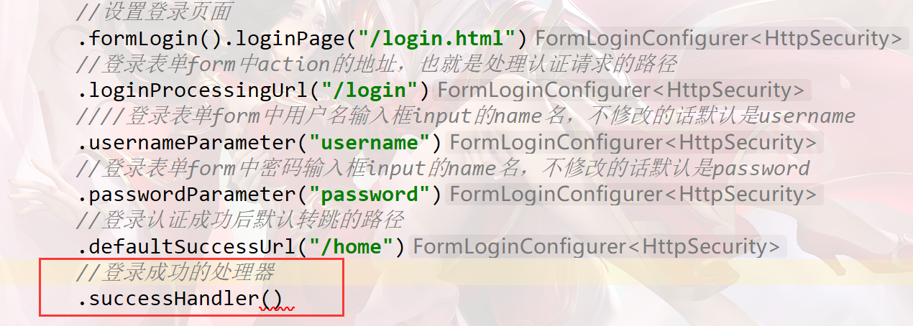

没错,就是红色框中的内容,它提供了我们一种自定义的方案,让我们看看源码

```java
/**
	 * Specifies the {@link AuthenticationSuccessHandler} to be used. The default is
	 * {@link SavedRequestAwareAuthenticationSuccessHandler} with no additional properties
	 * set.
	 * @param successHandler the {@link AuthenticationSuccessHandler}.
	 * @return the {@link FormLoginConfigurer} for additional customization
	 */
public final T successHandler(AuthenticationSuccessHandler successHandler) {
    this.successHandler = successHandler;
    return getSelf();
}
```

```java
/*
 * Copyright 2002-2016 the original author or authors.
 *
 * Licensed under the Apache License, Version 2.0 (the "License");
 * you may not use this file except in compliance with the License.
 * You may obtain a copy of the License at
 *
 *      https://www.apache.org/licenses/LICENSE-2.0
 *
 * Unless required by applicable law or agreed to in writing, software
 * distributed under the License is distributed on an "AS IS" BASIS,
 * WITHOUT WARRANTIES OR CONDITIONS OF ANY KIND, either express or implied.
 * See the License for the specific language governing permissions and
 * limitations under the License.
 */

package org.springframework.security.web.authentication;

import java.io.IOException;

import javax.servlet.FilterChain;
import javax.servlet.ServletException;
import javax.servlet.http.HttpServletRequest;
import javax.servlet.http.HttpServletResponse;

import org.springframework.security.core.Authentication;

/**
 * Strategy used to handle a successful user authentication.
 * <p>
 * Implementations can do whatever they want but typical behaviour would be to control the
 * navigation to the subsequent destination (using a redirect or a forward). For example,
 * after a user has logged in by submitting a login form, the application needs to decide
 * where they should be redirected to afterwards (see
 * {@link AbstractAuthenticationProcessingFilter} and subclasses). Other logic may also be
 * included if required.
 *
 * @author Luke Taylor
 * @since 3.0
 */
public interface AuthenticationSuccessHandler {

	/**
	 * Called when a user has been successfully authenticated.
	 * @param request the request which caused the successful authentication
	 * @param response the response
	 * @param chain the {@link FilterChain} which can be used to proceed other filters in
	 * the chain
	 * @param authentication the <tt>Authentication</tt> object which was created during
	 * the authentication process.
	 * @since 5.2.0
	 */
	default void onAuthenticationSuccess(HttpServletRequest request, HttpServletResponse response, FilterChain chain,
			Authentication authentication) throws IOException, ServletException {
		onAuthenticationSuccess(request, response, authentication);
		chain.doFilter(request, response);
	}

	/**
	 * Called when a user has been successfully authenticated.
	 * @param request the request which caused the successful authentication
	 * @param response the response
	 * @param authentication the <tt>Authentication</tt> object which was created during
	 * the authentication process.
	 */
	void onAuthenticationSuccess(HttpServletRequest request, HttpServletResponse response,
			Authentication authentication) throws IOException, ServletException;
}
```

看完源码之后我们发现,它提供了这么一个`AuthenticationSuccessHandler`,虽然这个接口有一些实现类,但是那些实现类中并不是我们需要的处理方案,所以我们可以实现这个接口,写一个自定义的登录成功处理器类

`MyAuthenticationSuccessHandler`

```java
package com.xiaoge.auth;

import cn.hutool.json.JSON;
import com.fasterxml.jackson.databind.ObjectMapper;
import com.xiaoge.response.Result;
import org.springframework.security.core.Authentication;
import org.springframework.security.web.authentication.AuthenticationSuccessHandler;
import org.springframework.stereotype.Component;

import javax.servlet.ServletException;
import javax.servlet.http.HttpServletRequest;
import javax.servlet.http.HttpServletResponse;
import java.io.IOException;

/**
 * 登录成功操作
 */
@Component
public class MyAuthenticationSuccessHandler implements AuthenticationSuccessHandler {
    @Override
    public void onAuthenticationSuccess(HttpServletRequest request, HttpServletResponse response, Authentication authentication) throws IOException, ServletException {

        Result result = Result.ok().message("登录成功");
        //处理编码方式，防止中文乱码的情况
        response.setContentType("text/json;charset=utf-8");
        //塞到HttpServletResponse中返回给前台
        //这是springboot中jackson给我们提供的一种能将类或者其他对象转成json的方式
        response.getWriter().write(new ObjectMapper().writeValueAsString(result));
    }
}
```

`WebSecurityConfig`

```java
package com.xiaoge.auth;

@Configuration
public class WebSecurityConfig extends WebSecurityConfigurerAdapter {

    @Bean
    public PasswordEncoder passwordEncoder(){
        return new BCryptPasswordEncoder();
    }

    @Autowired
    private PasswordEncoder passwordEncoder;

    @Autowired
    private UserDetailsService userDetailsService;

    @Autowired
    private MyAuthenticationSuccessHandler myAuthenticationSuccessHandler;

    @Override
    protected void configure(AuthenticationManagerBuilder auth) throws Exception {
        /*//在内存中配置用户名和密码
        auth.inMemoryAuthentication()
                .withUser("user")
                .password(passwordEncoder().encode("123"))
                .roles("user")
                .and()
                .withUser("admin")
                .password(passwordEncoder().encode("123"))
                .roles("admin")
                .and()
                .passwordEncoder(passwordEncoder());//配置BCrypt加密*/

        auth.userDetailsService(userDetailsService)
                .passwordEncoder(passwordEncoder);
    }

    @Override
    public void configure(WebSecurity web) throws Exception {
        super.configure(web);
    }

    @Override
    protected void configure(HttpSecurity http) throws Exception {
        /*//开启httpBasic认证
        http.httpBasic()
                .and()
                .authorizeRequests()
                .anyRequest()
                //所有请求都需要登录认证才能访问
                .authenticated();*/

        http.authorizeRequests()
                //需要放行的url在这里配置,必须要放行/login和/login.html,不然会报错
                .antMatchers("/login","/login.html").permitAll()
                //
                .antMatchers("/users","/roles")
                //.hasAuthority("ROLE_user")
                .hasAnyAuthority("ROLE_user","ROLE_admin")
                .antMatchers("/menus","/others")
                //.hasRole("admin")
                .hasAnyRole("admin")
                .anyRequest()
                .authenticated()
                .and()
                // 设置登陆页
                .formLogin().loginPage("/login.html")
                //登录表单form中action的地址，也就是处理认证请求的路径
                .loginProcessingUrl("/login")
                //登录表单form中用户名输入框input的name名，不修改的话默认是username
                .usernameParameter("username")
                //登录表单form中密码输入框input的name名，不修改的话默认是password
                .passwordParameter("password")
                //登录认证成功后默认转跳的路径
                //.defaultSuccessUrl("/home").permitAll()
                // 登录失败Url
                //.failureUrl("/login/error");
                .successHandler(myAuthenticationSuccessHandler);

        //关闭CSRF跨域
        //详解什么是CSRF:https://www.cnblogs.com/pengdai/p/12164754.html
        http.csrf().disable();
    }
}
```

启动项目,使用`postman`进行测试：http://localhost:8080/login?username=xiaoge&password=123

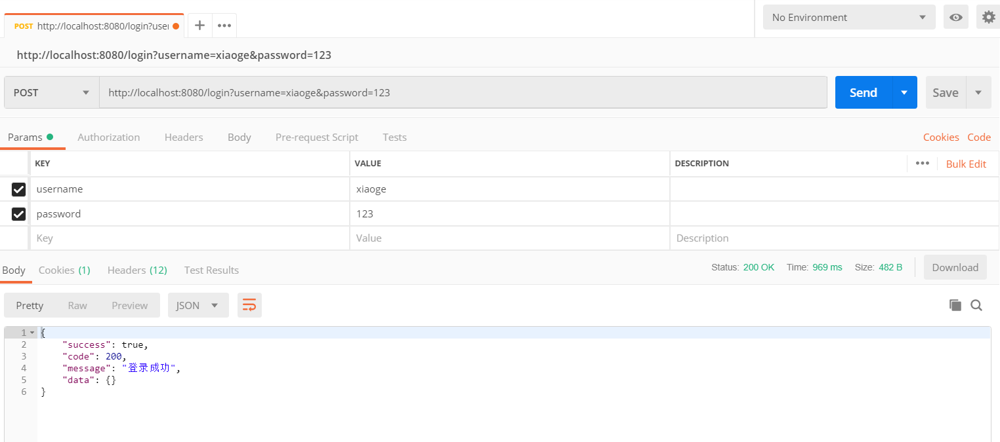

我们可以看到后台返回了一串对应的经过`Result`类封装过的JSON数据,前端可以拿到这个JSON数据进行判断,应该如何去跳转前端页面.

## 自定义登录失败处理方案

同样的,有登录成功的处理器就有登录失败的处理器,但是登录失败的情况比较多,所以需要经过很多的判断

登录失败处理器主要用来对登录失败的场景（密码错误、账号锁定等…）做统一处理并返回给前台统一的json返回体。

`MyAuthenticationFailureHandler`

```java
package com.xiaoge.auth;

import com.fasterxml.jackson.databind.ObjectMapper;
import com.xiaoge.response.Result;
import com.xiaoge.response.ResultCode;
import org.springframework.security.authentication.*;
import org.springframework.security.core.AuthenticationException;
import org.springframework.security.web.authentication.AuthenticationFailureHandler;
import org.springframework.stereotype.Component;

import javax.servlet.ServletException;
import javax.servlet.http.HttpServletRequest;
import javax.servlet.http.HttpServletResponse;
import java.io.IOException;

@Component
public class MyAuthenticationFailureHandler implements AuthenticationFailureHandler {
    @Override
    public void onAuthenticationFailure(HttpServletRequest request, HttpServletResponse response, AuthenticationException e) throws IOException, ServletException {
        Result result = null;
        if (e instanceof AccountExpiredException) {
            //账号过期
            result = Result.error(ResultCode.USER_ACCOUNT_EXPIRED);
        } else if (e instanceof BadCredentialsException) {
            //密码错误
            result = Result.error(ResultCode.USER_CREDENTIALS_ERROR);
        } else if (e instanceof CredentialsExpiredException) {
            //密码过期
            result = Result.error(ResultCode.USER_CREDENTIALS_EXPIRED);
        } else if (e instanceof DisabledException) {
            //账号不可用
            result = Result.error(ResultCode.USER_ACCOUNT_DISABLE);
        } else if (e instanceof LockedException) {
            //账号锁定
            result = Result.error(ResultCode.USER_ACCOUNT_LOCKED);
        } else if (e instanceof InternalAuthenticationServiceException) {
            //用户不存在
            result = Result.error(ResultCode.USER_ACCOUNT_NOT_EXIST);
        }else{
            //其他错误
            result = Result.error(ResultCode.COMMON_FAIL);
        }
        //处理编码方式，防止中文乱码的情况
        response.setContentType("text/json;charset=utf-8");
        //塞到HttpServletResponse中返回给前台
        //这是springboot中jackson给我们提供的一种能将类或者其他对象转成json的方式
        response.getWriter().write(new ObjectMapper().writeValueAsString(result));
    }
}
```

`WebSecurityConfig`

```java
package com.xiaoge.auth;

@Configuration
public class WebSecurityConfig extends WebSecurityConfigurerAdapter {

    @Bean
    public PasswordEncoder passwordEncoder(){
        return new BCryptPasswordEncoder();
    }

    @Autowired
    private PasswordEncoder passwordEncoder;

    @Autowired
    private UserDetailsService userDetailsService;

    @Autowired
    private MyAuthenticationSuccessHandler myAuthenticationSuccessHandler;

    @Autowired
    private MyAuthenticationFailureHandler myAuthenticationFailureHandler;

    @Override
    protected void configure(AuthenticationManagerBuilder auth) throws Exception {
        /*//在内存中配置用户名和密码
        auth.inMemoryAuthentication()
                .withUser("user")
                .password(passwordEncoder().encode("123"))
                .roles("user")
                .and()
                .withUser("admin")
                .password(passwordEncoder().encode("123"))
                .roles("admin")
                .and()
                .passwordEncoder(passwordEncoder());//配置BCrypt加密*/

        auth.userDetailsService(userDetailsService)
                .passwordEncoder(passwordEncoder);
    }

    @Override
    public void configure(WebSecurity web) throws Exception {
        super.configure(web);
    }

    @Override
    protected void configure(HttpSecurity http) throws Exception {
        /*//开启httpBasic认证
        http.httpBasic()
                .and()
                .authorizeRequests()
                .anyRequest()
                //所有请求都需要登录认证才能访问
                .authenticated();*/

        http.authorizeRequests()
                //需要放行的url在这里配置,必须要放行/login和/login.html,不然会报错
                .antMatchers("/login","/login.html").permitAll()
                //
                .antMatchers("/users","/roles")
                //.hasAuthority("ROLE_user")
                .hasAnyAuthority("ROLE_user","ROLE_admin")
                .antMatchers("/menus","/others")
                //.hasRole("admin")
                .hasAnyRole("admin")
                .anyRequest()
                .authenticated()
                .and()
                // 设置登陆页
                .formLogin().loginPage("/login.html")
                //登录表单form中action的地址，也就是处理认证请求的路径
                .loginProcessingUrl("/login")
                //登录表单form中用户名输入框input的name名，不修改的话默认是username
                .usernameParameter("username")
                //登录表单form中密码输入框input的name名，不修改的话默认是password
                .passwordParameter("password")
                //登录认证成功后默认转跳的路径
                //.defaultSuccessUrl("/home").permitAll()
                // 登录失败Url
                //.failureUrl("/login/error");
                .successHandler(myAuthenticationSuccessHandler)
                .failureHandler(myAuthenticationFailureHandler);

        //关闭CSRF跨域
        //详解什么是CSRF:https://www.cnblogs.com/pengdai/p/12164754.html
        http.csrf().disable();
    }
}
```

启动项目,使用`postman`进行测试：http://localhost:8080/login?username=xiaoge&password=456

此时我的密码并不是456而是123,接下来我们看测试结果


## 封装JSON返回

有没有发现,`MyAuthenticationSuccessHandler`和 `MyAuthenticationFailureHandler`都有一段重复的代码

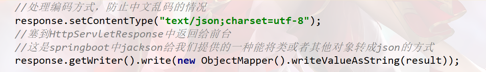

虽然只是简单的两行,但是这种自定义处理器的类是非常多的,所以为了后续我们能够更好的封装和调用数据,我们这里封装一个类,专门用来返回JSON数据,并且实现跨域和乱码的处理

`JSONAuthentication`

```java
package com.xiaoge.auth;

import com.fasterxml.jackson.databind.ObjectMapper;

import javax.servlet.ServletException;
import javax.servlet.http.HttpServletRequest;
import javax.servlet.http.HttpServletResponse;
import java.io.IOException;
import java.io.PrintWriter;

/**
 * 封装输出JSON格式的类
 */
public abstract class JSONAuthentication {
    /**
     * 输出JSON
     * @param request
     * @param response
     * @param data
     * @throws IOException
     * @throws ServletException
     */
    protected void WriteJSON(HttpServletRequest request,
                             HttpServletResponse response,
                             Object data) throws IOException, ServletException {
        //这里很重要，否则页面获取不到正常的JSON数据集
        response.setContentType("application/json;charset=UTF-8");
        response.setHeader("Access-Control-Allow-Origin", "*");
        response.setHeader("Access-Control-Allow-Method", "POST,GET");
        //输出JSON
        PrintWriter out = response.getWriter();
        out.write(new ObjectMapper().writeValueAsString(data));
        out.flush();
        out.close();
    }
}
```

改造`MyAuthenticationSuccessHandler`和 `MyAuthenticationFailureHandler`

```java
package com.xiaoge.auth;

import com.xiaoge.response.Result;
import org.springframework.security.core.Authentication;
import org.springframework.security.web.authentication.AuthenticationSuccessHandler;
import org.springframework.stereotype.Component;

import javax.servlet.ServletException;
import javax.servlet.http.HttpServletRequest;
import javax.servlet.http.HttpServletResponse;
import java.io.IOException;

/**
 * 登录成功操作
 */
@Component
public class MyAuthenticationSuccessHandler extends JSONAuthentication implements AuthenticationSuccessHandler {
    @Override
    public void onAuthenticationSuccess(HttpServletRequest request, HttpServletResponse response, Authentication authentication) throws IOException, ServletException {

        Result result = Result.ok().message("登录成功");
        /*//处理编码方式，防止中文乱码的情况
        response.setContentType("text/json;charset=utf-8");
        //塞到HttpServletResponse中返回给前台
        //这是springboot中jackson给我们提供的一种能将类或者其他对象转成json的方式
        response.getWriter().write(new ObjectMapper().writeValueAsString(result));*/

        //输出
        this.WriteJSON(request, response, result);
    }
}
```

```java
package com.xiaoge.auth;

import com.xiaoge.response.Result;
import com.xiaoge.response.ResultCode;
import org.springframework.security.authentication.*;
import org.springframework.security.core.AuthenticationException;
import org.springframework.security.web.authentication.AuthenticationFailureHandler;
import org.springframework.stereotype.Component;

import javax.servlet.ServletException;
import javax.servlet.http.HttpServletRequest;
import javax.servlet.http.HttpServletResponse;
import java.io.IOException;

@Component
public class MyAuthenticationFailureHandler extends JSONAuthentication implements AuthenticationFailureHandler {
    @Override
    public void onAuthenticationFailure(HttpServletRequest request, HttpServletResponse response, AuthenticationException e) throws IOException, ServletException {
        Result result = null;
        if (e instanceof AccountExpiredException) {
            //账号过期
            result = Result.error(ResultCode.USER_ACCOUNT_EXPIRED);
        } else if (e instanceof BadCredentialsException) {
            //密码错误
            result = Result.error(ResultCode.USER_CREDENTIALS_ERROR);
        } else if (e instanceof CredentialsExpiredException) {
            //密码过期
            result = Result.error(ResultCode.USER_CREDENTIALS_EXPIRED);
        } else if (e instanceof DisabledException) {
            //账号不可用
            result = Result.error(ResultCode.USER_ACCOUNT_DISABLE);
        } else if (e instanceof LockedException) {
            //账号锁定
            result = Result.error(ResultCode.USER_ACCOUNT_LOCKED);
        } else if (e instanceof InternalAuthenticationServiceException) {
            //用户不存在
            result = Result.error(ResultCode.USER_ACCOUNT_NOT_EXIST);
        }else{
            //其他错误
            result = Result.error(ResultCode.COMMON_FAIL);
        }
        /*//处理编码方式，防止中文乱码的情况
        response.setContentType("text/json;charset=utf-8");
        //塞到HttpServletResponse中返回给前台
        //这是springboot中jackson给我们提供的一种能将类或者其他对象转成json的方式
        response.getWriter().write(new ObjectMapper().writeValueAsString(result));*/

        //输出
        this.WriteJSON(request, response, result);
    }
}
```

## 用户未登录处理方案

演示登录时，如果用户没有登录去请求资源接口就会提示未登录
在前后端不分离的时候当用户未登录去访问资源时Spring security会重定向到默认的登录页面，返回的是一串html标签，这一串html标签其实就是登录页面的提交表单。如图所示


而在前后端分离的情况下（比如前台使用VUE或JQ等）我们需要的是在前台接收到"用户未登录"的提示信息，所以我们接下来要做的就是屏蔽重定向的登录页面，并返回统一的json格式的返回体。而实现这一功能的核心就是实现AuthenticationEntryPoint并在WebSecurityConfig中注入，然后在configure(HttpSecurity http)方法中。AuthenticationEntryPoint主要是用来处理匿名用户访问无权限资源时的异常（即**未登录，或者登录状态过期失效**）

`MyAuthenticationEntryPoint`

```java
package com.xiaoge.auth;

import com.xiaoge.response.Result;
import com.xiaoge.response.ResultCode;
import org.springframework.security.core.AuthenticationException;
import org.springframework.security.web.AuthenticationEntryPoint;
import org.springframework.stereotype.Component;

import javax.servlet.ServletException;
import javax.servlet.http.HttpServletRequest;
import javax.servlet.http.HttpServletResponse;
import java.io.IOException;

/**
 *  匿名用户访问无权限资源时的异常
 */
@Component("myAuthenticationEntryPoint")
public class MyAuthenticationEntryPoint extends JSONAuthentication implements AuthenticationEntryPoint {
    @Override
    public void commence(HttpServletRequest request, HttpServletResponse response, AuthenticationException e) throws IOException, ServletException {
        Result result = Result.error(ResultCode.USER_NOT_LOGIN);

        this.WriteJSON(request,response,result);
    }
}
```

`WebSecurityConfig`

```java
@Configuration
public class WebSecurityConfig extends WebSecurityConfigurerAdapter {

    @Bean
    public PasswordEncoder passwordEncoder(){
        return new BCryptPasswordEncoder();
    }

    @Autowired
    private PasswordEncoder passwordEncoder;

    @Autowired
    private UserDetailsService userDetailsService;

    @Autowired
    private MyAuthenticationSuccessHandler myAuthenticationSuccessHandler;

    @Autowired
    private MyAuthenticationFailureHandler myAuthenticationFailureHandler;

    @Autowired
    private MyAuthenticationEntryPoint myAuthenticationEntryPoint;

    @Override
    protected void configure(AuthenticationManagerBuilder auth) throws Exception {
        /*//在内存中配置用户名和密码
        auth.inMemoryAuthentication()
                .withUser("user")
                .password(passwordEncoder().encode("123"))
                .roles("user")
                .and()
                .withUser("admin")
                .password(passwordEncoder().encode("123"))
                .roles("admin")
                .and()
                .passwordEncoder(passwordEncoder());//配置BCrypt加密*/

        auth.userDetailsService(userDetailsService)
                .passwordEncoder(passwordEncoder);
    }

    @Override
    public void configure(WebSecurity web) throws Exception {
        super.configure(web);
    }

    @Override
    protected void configure(HttpSecurity http) throws Exception {
        /*//开启httpBasic认证
        http.httpBasic()
                .and()
                .authorizeRequests()
                .anyRequest()
                //所有请求都需要登录认证才能访问
                .authenticated();*/

        http.authorizeRequests()
                //需要放行的url在这里配置,必须要放行/login和/login.html,不然会报错
                .antMatchers("/login","/login.html").permitAll()
                //
                .antMatchers("/users","/roles")
                //.hasAuthority("ROLE_user")
                .hasAnyAuthority("ROLE_user","ROLE_admin")
                .antMatchers("/menus","/others")
                //.hasRole("admin")
                .hasAnyRole("admin")
                .anyRequest()
                .authenticated()
                .and()
                // 设置登陆页
                .formLogin().loginPage("/login.html")
                //登录表单form中action的地址，也就是处理认证请求的路径
                .loginProcessingUrl("/login")
                //登录表单form中用户名输入框input的name名，不修改的话默认是username
                .usernameParameter("username")
                //登录表单form中密码输入框input的name名，不修改的话默认是password
                .passwordParameter("password")
                //登录认证成功后默认转跳的路径
                //.defaultSuccessUrl("/home").permitAll()
                // 登录失败Url
                //.failureUrl("/login/error");
                .successHandler(myAuthenticationSuccessHandler)
                .failureHandler(myAuthenticationFailureHandler)
                .and()
                .exceptionHandling()
                .authenticationEntryPoint(myAuthenticationEntryPoint);

        //关闭CSRF跨域
        //详解什么是CSRF:https://www.cnblogs.com/pengdai/p/12164754.html
        http.csrf().disable();
    }
}
```

启动项目,使用`postman`进行测试：http://localhost:8080/users

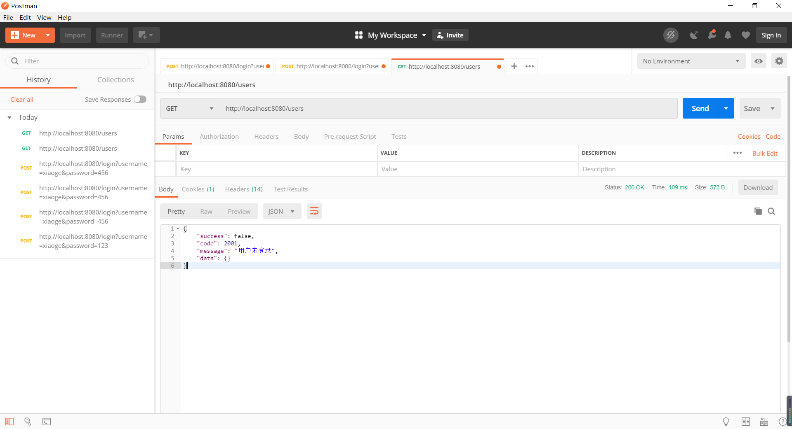

接下来我们登录一下：http://localhost:8080/login?username=xiaoge&password=123

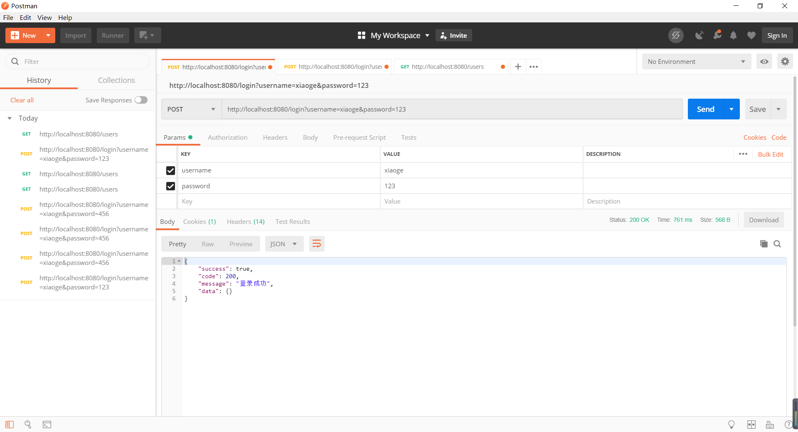

再去访问：http://localhost:8080/users

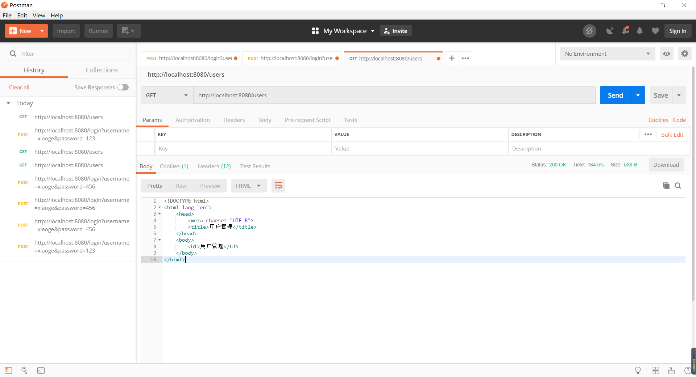

我们可以看到只要登录了就可以访问了,但是新的问题又出现了,我们换个账户使用`ange`进行登录

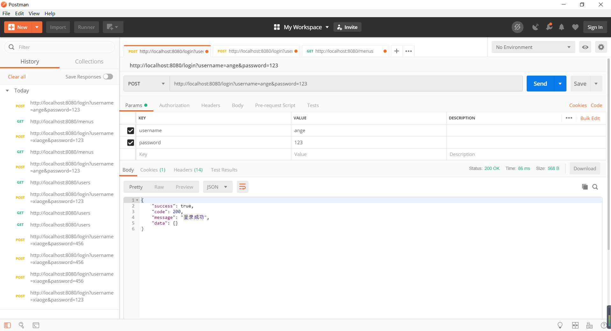

我们知道,ange这个账户不是admin账户,不能访问menus和others


我们直接访问menus,直接报错了,这个权限不足怎么解决呢?接着看

## 权限不足处理方案

肯定不能像上面那样展示一个错误信息的,用户想要看到的肯定是一个权限不足的提示

`MyAccessDeniedHandler`

```java
package com.xiaoge.auth;

import com.xiaoge.response.Result;
import com.xiaoge.response.ResultCode;
import org.springframework.security.access.AccessDeniedException;
import org.springframework.security.web.access.AccessDeniedHandler;
import org.springframework.stereotype.Component;

import javax.servlet.ServletException;
import javax.servlet.http.HttpServletRequest;
import javax.servlet.http.HttpServletResponse;
import java.io.IOException;

/**
 * 权限不足处理器
 */
@Component("myAccessDeniedHandler")
public class MyAccessDeniedHandler extends JSONAuthentication implements AccessDeniedHandler {
    @Override
    public void handle(HttpServletRequest request, HttpServletResponse response, AccessDeniedException e) throws IOException, ServletException {
        Result result = Result.error(ResultCode.NO_PERMISSION)/*.message(e.getMessage())*/;

        this.WriteJSON(request,response,result);
    }
}
```

`WebSecurityConfig`

```java
@Configuration
public class WebSecurityConfig extends WebSecurityConfigurerAdapter {

    @Bean
    public PasswordEncoder passwordEncoder(){
        return new BCryptPasswordEncoder();
    }

    /**
     * 密码加密处理类
     */
    @Autowired
    private PasswordEncoder passwordEncoder;

    /**
     * 自定义用户登录接口
     */
    @Autowired
    private UserDetailsService userDetailsService;

    /**
     * 登录成功处理器
     */
    @Autowired
    private MyAuthenticationSuccessHandler myAuthenticationSuccessHandler;

    /**
     * 登录失败处理器
     */
    @Autowired
    private MyAuthenticationFailureHandler myAuthenticationFailureHandler;

    /**
     * 未登录，或者登录状态过期失效处理器
     */
    @Autowired
    private MyAuthenticationEntryPoint myAuthenticationEntryPoint;

    /**
     * 权限不足处理方案
     */
    @Autowired
    private MyAccessDeniedHandler myAccessDeniedHandler;

    @Override
    protected void configure(AuthenticationManagerBuilder auth) throws Exception {
        /*//在内存中配置用户名和密码
        auth.inMemoryAuthentication()
                .withUser("user")
                .password(passwordEncoder().encode("123"))
                .roles("user")
                .and()
                .withUser("admin")
                .password(passwordEncoder().encode("123"))
                .roles("admin")
                .and()
                .passwordEncoder(passwordEncoder());//配置BCrypt加密*/

        auth.userDetailsService(userDetailsService)
                .passwordEncoder(passwordEncoder);
    }

    @Override
    public void configure(WebSecurity web) throws Exception {
        super.configure(web);
    }

    @Override
    protected void configure(HttpSecurity http) throws Exception {
        /*//开启httpBasic认证
        http.httpBasic()
                .and()
                .authorizeRequests()
                .anyRequest()
                //所有请求都需要登录认证才能访问
                .authenticated();*/

        http.authorizeRequests()
                //需要放行的url在这里配置,必须要放行/login和/login.html,不然会报错
                .antMatchers("/login","/login.html").permitAll()
                //
                .antMatchers("/users","/roles")
                //.hasAuthority("ROLE_user")
                .hasAnyAuthority("ROLE_user","ROLE_admin")
                .antMatchers("/menus","/others")
                //.hasRole("admin")
                .hasAnyRole("admin")
                .anyRequest()
                .authenticated()
                .and()
                // 设置登陆页
                .formLogin().loginPage("/login.html")
                //登录表单form中action的地址，也就是处理认证请求的路径
                .loginProcessingUrl("/login")
                //登录表单form中用户名输入框input的name名，不修改的话默认是username
                .usernameParameter("username")
                //登录表单form中密码输入框input的name名，不修改的话默认是password
                .passwordParameter("password")
                //登录认证成功后默认转跳的路径
                //.defaultSuccessUrl("/home").permitAll()
                // 登录失败Url
                //.failureUrl("/login/error");
                .successHandler(myAuthenticationSuccessHandler)
                .failureHandler(myAuthenticationFailureHandler)
                .and()
                .exceptionHandling()
                .accessDeniedHandler(myAccessDeniedHandler)
                .authenticationEntryPoint(myAuthenticationEntryPoint);

        //关闭CSRF跨域
        //详解什么是CSRF:https://www.cnblogs.com/pengdai/p/12164754.html
        http.csrf().disable();
    }
}
```

## 注销成功处理方案

我们知道，SpringSecurity给我们提供了注销的控制器,默认是`/logout`,同样的,我们去使用postman访问一下


注销成功之后返回登录的页面,逻辑是没有错的,但是在前后端分离的情况下是返回登录页面吗?显然不是,而是返回注销成功的信息给我们吧,我们通过注销的信息到前端进行判断,接下来我们需要自定义注销成功的处理器了

`MyLogoutHandler`

```java
package com.xiaoge.auth;

import cn.hutool.core.util.StrUtil;
import org.springframework.security.core.Authentication;
import org.springframework.security.core.context.SecurityContextHolder;
import org.springframework.security.web.authentication.logout.LogoutHandler;
import org.springframework.stereotype.Component;

import javax.servlet.http.HttpServletRequest;
import javax.servlet.http.HttpServletResponse;

/**
 * 退出Handler
 */
@Component("myLogoutHandler")
public class MyLogoutHandler extends JSONAuthentication implements LogoutHandler {


    @Override
    public void logout(HttpServletRequest request, HttpServletResponse response, Authentication authentication) {
        String headerToken = request.getHeader("Authorization");
        System.out.println("logout header Token = " + headerToken);
        System.out.println("logout request getMethod = " + request.getMethod());
        //
        if (!StrUtil.isEmpty(headerToken)) {
            //postMan测试时，自动假如的前缀，要去掉。
            String token = headerToken.replace("Bearer", "").trim();
            System.out.println("authentication = " + authentication);
            SecurityContextHolder.clearContext();
        }
    }
}
```

`MyLogoutSuccessHandler`

```java
package com.xiaoge.auth;

import com.xiaoge.response.Result;
import org.springframework.security.core.Authentication;
import org.springframework.security.web.authentication.logout.LogoutSuccessHandler;
import org.springframework.stereotype.Component;

import javax.servlet.ServletException;
import javax.servlet.http.HttpServletRequest;
import javax.servlet.http.HttpServletResponse;
import java.io.IOException;

/**
 * 注销成功处理器
 */
@Component("myLogoutSuccessHandler")
public class MyLogoutSuccessHandler extends JSONAuthentication implements LogoutSuccessHandler {
    @Override
    public void onLogoutSuccess(HttpServletRequest request,
                                HttpServletResponse response,
                                Authentication authentication) throws IOException, ServletException {
        Result result = Result.ok().message("注销成功");
        super.WriteJSON(request,response,result);
    }
}
```

`WebSecurityConfig`

```java
@Configuration
public class WebSecurityConfig extends WebSecurityConfigurerAdapter {

    @Bean
    public PasswordEncoder passwordEncoder(){
        return new BCryptPasswordEncoder();
    }

    /**
     * 密码加密处理类
     */
    @Autowired
    private PasswordEncoder passwordEncoder;

    /**
     * 自定义用户登录接口
     */
    @Autowired
    private UserDetailsService userDetailsService;

    /**
     * 登录成功处理器
     */
    @Autowired
    private MyAuthenticationSuccessHandler myAuthenticationSuccessHandler;

    /**
     * 登录失败处理器
     */
    @Autowired
    private MyAuthenticationFailureHandler myAuthenticationFailureHandler;

    /**
     * 未登录，或者登录状态过期失效处理器
     */
    @Autowired
    private MyAuthenticationEntryPoint myAuthenticationEntryPoint;

    /**
     * 权限不足处理器
     */
    @Autowired
    private MyAccessDeniedHandler myAccessDeniedHandler;

    /**
     * 注销操作处理器
     */
    @Autowired
    private MyLogoutHandler myLogoutHandler;

    /**
     * 注销成功处理器
     */
    @Autowired
    private MyLogoutSuccessHandler myLogoutSuccessHandler;

    @Override
    protected void configure(AuthenticationManagerBuilder auth) throws Exception {
        /*//在内存中配置用户名和密码
        auth.inMemoryAuthentication()
                .withUser("user")
                .password(passwordEncoder().encode("123"))
                .roles("user")
                .and()
                .withUser("admin")
                .password(passwordEncoder().encode("123"))
                .roles("admin")
                .and()
                .passwordEncoder(passwordEncoder());//配置BCrypt加密*/

        auth.userDetailsService(userDetailsService)
                .passwordEncoder(passwordEncoder);
    }

    @Override
    public void configure(WebSecurity web) throws Exception {
        super.configure(web);
    }

    @Override
    protected void configure(HttpSecurity http) throws Exception {
        /*//开启httpBasic认证
        http.httpBasic()
                .and()
                .authorizeRequests()
                .anyRequest()
                //所有请求都需要登录认证才能访问
                .authenticated();*/

        http.authorizeRequests()
                //需要放行的url在这里配置,必须要放行/login和/login.html,不然会报错
                .antMatchers("/login","/login.html").permitAll()
                //
                .antMatchers("/users","/roles")
                //.hasAuthority("ROLE_user")
                .hasAnyAuthority("ROLE_user","ROLE_admin")
                .antMatchers("/menus","/others")
                //.hasRole("admin")
                .hasAnyRole("admin")
                .anyRequest()
                .authenticated()
                .and()
                .logout().permitAll()
                .addLogoutHandler(myLogoutHandler)
                .logoutSuccessHandler(myLogoutSuccessHandler)
                //登出之后删除cookie
                .deleteCookies("JSESSIONID")
                .and()
                // 设置登陆页
                .formLogin().loginPage("/login.html")
                //登录表单form中action的地址，也就是处理认证请求的路径
                .loginProcessingUrl("/login")
                //登录表单form中用户名输入框input的name名，不修改的话默认是username
                .usernameParameter("username")
                //登录表单form中密码输入框input的name名，不修改的话默认是password
                .passwordParameter("password")
                //登录认证成功后默认转跳的路径
                //.defaultSuccessUrl("/home").permitAll()
                // 登录失败Url
                //.failureUrl("/login/error");
                .successHandler(myAuthenticationSuccessHandler)
                .failureHandler(myAuthenticationFailureHandler)
                .and()
                .exceptionHandling()
                .accessDeniedHandler(myAccessDeniedHandler)
                .authenticationEntryPoint(myAuthenticationEntryPoint);

        //关闭CSRF跨域
        //详解什么是CSRF:https://www.cnblogs.com/pengdai/p/12164754.html
        http.csrf().disable();
    }
}
```

再去访问：http://localhost:8080/logout


# 会话管理

其实会话管理完全可以归纳在前后端分离处理方案中的,但是为什么要单独拿出来作为一章呢?因为这个会话管理非常重要,会关系到我们后面前后端分离处理的方式不一样

## 会话创建方式

Spring Security提供4种方式精确的控制会话的创建：

- **always**：如果当前请求没有对应的session存在，Spring Security创建一个session。
- **ifRequired（默认）**： Spring Security在需要使用到session时才创建session
- **never**： Spring Security将永远不会主动创建session，但是如果session在当前应用中已经存在，它将使用该session
- **stateless**：Spring Security不会创建或使用任何session。适合于接口型的无状态应用（前后端分离无状态应用），这种方式节省内存资源

默认情况下,我们使用postman测试的时候都会给我们生成session了的,不然我们登录之后,去访问其他的接口仍然会生效,就是因为我们的登录状态被保存下来了,如果我们配置不同的session参数,看看结果会怎么样

在Spring Security配置中加入session创建的策略。继承WebSecurityConfigurerAdapter ，重写configure(HttpSecurity http) 方法

```java
@Override
protected void configure(HttpSecurity http) throws Exception {
    http.sessionManagement()
        .sessionCreationPolicy(
                SessionCreationPolicy.IF_REQUIRED
        )
}
```

`WebSecurityConfig`

```java
@Configuration
public class WebSecurityConfig extends WebSecurityConfigurerAdapter {

    @Bean
    public PasswordEncoder passwordEncoder(){
        return new BCryptPasswordEncoder();
    }

    /**
     * 密码加密处理类
     */
    @Autowired
    private PasswordEncoder passwordEncoder;

    /**
     * 自定义用户登录接口
     */
    @Autowired
    private UserDetailsService userDetailsService;

    /**
     * 登录成功处理器
     */
    @Autowired
    private MyAuthenticationSuccessHandler myAuthenticationSuccessHandler;

    /**
     * 登录失败处理器
     */
    @Autowired
    private MyAuthenticationFailureHandler myAuthenticationFailureHandler;

    /**
     * 未登录，或者登录状态过期失效处理器
     */
    @Autowired
    private MyAuthenticationEntryPoint myAuthenticationEntryPoint;

    /**
     * 权限不足处理器
     */
    @Autowired
    private MyAccessDeniedHandler myAccessDeniedHandler;

    /**
     * 注销成功处理器
     */
    @Autowired
    private MyLogoutSuccessHandler myLogoutSuccessHandler;

    @Override
    protected void configure(AuthenticationManagerBuilder auth) throws Exception {
        /*//在内存中配置用户名和密码
        auth.inMemoryAuthentication()
                .withUser("user")
                .password(passwordEncoder().encode("123"))
                .roles("user")
                .and()
                .withUser("admin")
                .password(passwordEncoder().encode("123"))
                .roles("admin")
                .and()
                .passwordEncoder(passwordEncoder());//配置BCrypt加密*/

        auth.userDetailsService(userDetailsService)
                .passwordEncoder(passwordEncoder);
    }

    @Override
    public void configure(WebSecurity web) throws Exception {
        super.configure(web);
    }

    @Override
    protected void configure(HttpSecurity http) throws Exception {
        /*//开启httpBasic认证
        http.httpBasic()
                .and()
                .authorizeRequests()
                .anyRequest()
                //所有请求都需要登录认证才能访问
                .authenticated();*/

        http.authorizeRequests()
                //需要放行的url在这里配置,必须要放行/login和/login.html,不然会报错
                .antMatchers("/login","/login.html").permitAll()
                //
                .antMatchers("/users","/roles")
                //.hasAuthority("ROLE_user")
                .hasAnyAuthority("ROLE_user","ROLE_admin")
                .antMatchers("/menus","/others")
                //.hasRole("admin")
                .hasAnyRole("admin")
                .anyRequest()
                .authenticated()
                .and()
                .logout().permitAll()
                .logoutSuccessHandler(myLogoutSuccessHandler)
                //登出之后删除cookie
                .deleteCookies("JSESSIONID")
                .and()
                // 设置登陆页
                .formLogin().loginPage("/login.html")
                //登录表单form中action的地址，也就是处理认证请求的路径
                .loginProcessingUrl("/login")
                //登录表单form中用户名输入框input的name名，不修改的话默认是username
                .usernameParameter("username")
                //登录表单form中密码输入框input的name名，不修改的话默认是password
                .passwordParameter("password")
                //登录认证成功后默认转跳的路径
                //.defaultSuccessUrl("/home").permitAll()
                // 登录失败Url
                //.failureUrl("/login/error");
                .successHandler(myAuthenticationSuccessHandler)
                .failureHandler(myAuthenticationFailureHandler)
                .and()
                .exceptionHandling()
                .accessDeniedHandler(myAccessDeniedHandler)
                .authenticationEntryPoint(myAuthenticationEntryPoint)
                .and()
            	//无状态的,任何时候都不会使用session
                .sessionManagement().sessionCreationPolicy(SessionCreationPolicy.STATELESS);

        //关闭CSRF跨域
        //详解什么是CSRF:https://www.cnblogs.com/pengdai/p/12164754.html
        http.csrf().disable();
    }
}
```

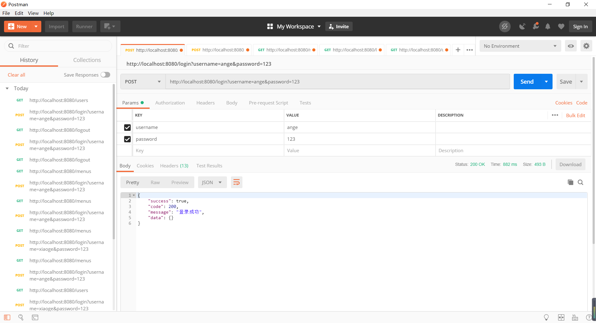

我现在已经登录了ange这个用户,肯定是有访问users权限的,但是


没登录,因为我们的登录状态并没有被session保存,那我们就知道session的作用了

## 会话超时管理

在Spring boot应用中有两种设置会话超时时间的方式，Spring Security对这两种方式完全兼容，即：当会话超时之后用户需要重新登录才能访问应用：

- server.servlet.session.timeout=1m
- spring.session.timeout = 1m

第一种方式是springBoot应用自带的session超时配置，第二种方式是我们使用Spring Session之后，提供的session超时配置。第二种方式的优先级更高。

> 注意：在Spring Boot中Session超时最短的时间是一分钟，当你的设置小于一分钟的时候，默认为一分钟。

当我们访问一个数据的时候,如果刚好会话过期了,其实直接跳转到登录页面也无妨,但是最好是告诉用户登录已经过期了,然后再跳转比较好,这边我们来自定义会话超时处理方案

`MyInvalidSessionStrategy`

```java
package com.xiaoge.auth;

import com.xiaoge.response.Result;
import com.xiaoge.response.ResultCode;
import org.springframework.security.web.session.InvalidSessionStrategy;
import org.springframework.stereotype.Component;

import javax.servlet.ServletException;
import javax.servlet.http.HttpServletRequest;
import javax.servlet.http.HttpServletResponse;
import java.io.IOException;

@Component("myInvalidSessionStrategy")
public class MyInvalidSessionStrategy extends JSONAuthentication implements InvalidSessionStrategy {
    @Override
    public void onInvalidSessionDetected(HttpServletRequest request, HttpServletResponse response) throws IOException, ServletException {
        Result result = Result.error(ResultCode.USER_SESSION_INVALID);
        this.WriteJSON(request,response,result);
    }
}
```

`application.yml`

```yaml
spring:
  datasource:
    driver-class-name: com.mysql.cj.jdbc.Driver
    url: jdbc:mysql://localhost:3306/security?useUnicode=true&characterEncoding=UTF-8&serverTimezone=GMT%2B8
    username: root
    password: root
  #这个和下面那个都是可以配置session超时的
  session:
    timeout: 1m
server:
  servlet:
    session:
      timeout: 1m

mybatis-plus:
  mapper-locations: classpath*:/mapper/*Mapper.xml
  configuration:
    log-impl: org.apache.ibatis.logging.stdout.StdOutImpl
  type-aliases-package: com.xiaoge.entity
```

`WebSecurityConfig`

```java
@Configuration
public class WebSecurityConfig extends WebSecurityConfigurerAdapter {

    @Bean
    public PasswordEncoder passwordEncoder(){
        return new BCryptPasswordEncoder();
    }

    /**
     * 密码加密处理类
     */
    @Autowired
    private PasswordEncoder passwordEncoder;

    /**
     * 自定义用户登录接口
     */
    @Autowired
    private UserDetailsService userDetailsService;

    /**
     * 登录成功处理器
     */
    @Autowired
    private MyAuthenticationSuccessHandler myAuthenticationSuccessHandler;

    /**
     * 登录失败处理器
     */
    @Autowired
    private MyAuthenticationFailureHandler myAuthenticationFailureHandler;

    /**
     * 未登录，或者登录状态过期失效处理器
     */
    @Autowired
    private MyAuthenticationEntryPoint myAuthenticationEntryPoint;

    /**
     * 权限不足处理器
     */
    @Autowired
    private MyAccessDeniedHandler myAccessDeniedHandler;

    /**
     * 注销成功处理器
     */
    @Autowired
    private MyLogoutSuccessHandler myLogoutSuccessHandler;

    /**
     * session过期(超时)处理方案
     */
    @Autowired
    private MyInvalidSessionStrategy myInvalidSessionStrategy;

    @Override
    protected void configure(AuthenticationManagerBuilder auth) throws Exception {
        /*//在内存中配置用户名和密码
        auth.inMemoryAuthentication()
                .withUser("user")
                .password(passwordEncoder().encode("123"))
                .roles("user")
                .and()
                .withUser("admin")
                .password(passwordEncoder().encode("123"))
                .roles("admin")
                .and()
                .passwordEncoder(passwordEncoder());//配置BCrypt加密*/

        auth.userDetailsService(userDetailsService)
                .passwordEncoder(passwordEncoder);
    }

    @Override
    public void configure(WebSecurity web) throws Exception {
        super.configure(web);
    }

    @Override
    protected void configure(HttpSecurity http) throws Exception {
        /*//开启httpBasic认证
        http.httpBasic()
                .and()
                .authorizeRequests()
                .anyRequest()
                //所有请求都需要登录认证才能访问
                .authenticated();*/

        http.authorizeRequests()
                //需要放行的url在这里配置,必须要放行/login和/login.html,不然会报错
                .antMatchers("/login","/login.html").permitAll()
                //
                .antMatchers("/users","/roles")
                //.hasAuthority("ROLE_user")
                .hasAnyAuthority("ROLE_user","ROLE_admin")
                .antMatchers("/menus","/others")
                //.hasRole("admin")
                .hasAnyRole("admin")
                .anyRequest()
                .authenticated()
                .and()
                .logout().permitAll()
                .logoutSuccessHandler(myLogoutSuccessHandler)
                //登出之后删除cookie
                .deleteCookies("JSESSIONID")
                .and()
                // 设置登陆页
                .formLogin().loginPage("/login.html")
                //登录表单form中action的地址，也就是处理认证请求的路径
                .loginProcessingUrl("/login")
                //登录表单form中用户名输入框input的name名，不修改的话默认是username
                .usernameParameter("username")
                //登录表单form中密码输入框input的name名，不修改的话默认是password
                .passwordParameter("password")
                //登录认证成功后默认转跳的路径
                //.defaultSuccessUrl("/home").permitAll()
                // 登录失败Url
                //.failureUrl("/login/error");
                .successHandler(myAuthenticationSuccessHandler)
                .failureHandler(myAuthenticationFailureHandler)
                .and()
                .exceptionHandling()
                .accessDeniedHandler(myAccessDeniedHandler)
                .authenticationEntryPoint(myAuthenticationEntryPoint)
                .and()
                .sessionManagement().invalidSessionStrategy(myInvalidSessionStrategy);//.sessionCreationPolicy(SessionCreationPolicy.STATELESS);

        //关闭CSRF跨域
        //详解什么是CSRF:https://www.cnblogs.com/pengdai/p/12164754.html
        http.csrf().disable();
    }
}
```

## 限制登录用户数量

比如限制同一账号只能一个用户使用

```java
and().sessionManagement().
                    maximumSessions(1)
```

## 账号被挤下线处理方案

`MyExpiredSessionStrategy`

```java
package com.xiaoge.auth;

import com.xiaoge.response.Result;
import com.xiaoge.response.ResultCode;
import org.springframework.security.web.session.SessionInformationExpiredEvent;
import org.springframework.security.web.session.SessionInformationExpiredStrategy;
import org.springframework.stereotype.Component;

import javax.servlet.ServletException;
import java.io.IOException;

/**
 * 当账户被踢下线的时候如何处理
 */
@Component("myExpiredSessionStrategy")
public class MyExpiredSessionStrategy extends JSONAuthentication implements SessionInformationExpiredStrategy {
    @Override
    public void onExpiredSessionDetected(SessionInformationExpiredEvent event) throws IOException, ServletException {
        Result result = Result.error(ResultCode.USER_ACCOUNT_USE_BY_OTHERS);
        this.WriteJSON(event.getRequest(),event.getResponse(),result);
    }
}
```

`WebSecurityConfig`

```java
package com.xiaoge.auth;

import org.springframework.beans.factory.annotation.Autowired;
import org.springframework.context.annotation.Bean;
import org.springframework.context.annotation.Configuration;
import org.springframework.security.config.annotation.authentication.builders.AuthenticationManagerBuilder;
import org.springframework.security.config.annotation.web.builders.HttpSecurity;
import org.springframework.security.config.annotation.web.builders.WebSecurity;
import org.springframework.security.config.annotation.web.configuration.WebSecurityConfigurerAdapter;
import org.springframework.security.core.userdetails.UserDetailsService;
import org.springframework.security.crypto.bcrypt.BCryptPasswordEncoder;
import org.springframework.security.crypto.password.PasswordEncoder;

@Configuration
public class WebSecurityConfig extends WebSecurityConfigurerAdapter {

    @Bean
    public PasswordEncoder passwordEncoder(){
        return new BCryptPasswordEncoder();
    }

    /**
     * 密码加密处理类
     */
    @Autowired
    private PasswordEncoder passwordEncoder;

    /**
     * 自定义用户登录接口
     */
    @Autowired，
    private UserDetailsService userDetailsService;

    /**
     * 登录成功处理器
     */
    @Autowired
    private MyAuthenticationSuccessHandler myAuthenticationSuccessHandler;

    /**
     * 登录失败处理器
     */
    @Autowired
    private MyAuthenticationFailureHandler myAuthenticationFailureHandler;

    /**
     * 未登录，或者登录状态过期失效处理器
     */
    @Autowired
    private MyAuthenticationEntryPoint myAuthenticationEntryPoint;

    /**
     * 权限不足处理器
     */
    @Autowired
    private MyAccessDeniedHandler myAccessDeniedHandler;

    /**
     * 注销成功处理器
     */
    @Autowired
    private MyLogoutSuccessHandler myLogoutSuccessHandler;

    /**
     * session过期(超时)处理方案
     */
    @Autowired
    private MyInvalidSessionStrategy myInvalidSessionStrategy;

    @Autowired
    private MyExpiredSessionStrategy myExpiredSessionStrategy;

    @Override
    protected void configure(AuthenticationManagerBuilder auth) throws Exception {
        /*//在内存中配置用户名和密码
        auth.inMemoryAuthentication()
                .withUser("user")
                .password(passwordEncoder().encode("123"))
                .roles("user")
                .and()
                .withUser("admin")
                .password(passwordEncoder().encode("123"))
                .roles("admin")
                .and()
                .passwordEncoder(passwordEncoder());//配置BCrypt加密*/

        auth.userDetailsService(userDetailsService)
                .passwordEncoder(passwordEncoder);
    }

    @Override
    public void configure(WebSecurity web) throws Exception {
        super.configure(web);
    }

    @Override
    protected void configure(HttpSecurity http) throws Exception {
        /*//开启httpBasic认证
        http.httpBasic()
                .and()
                .authorizeRequests()
                .anyRequest()
                //所有请求都需要登录认证才能访问
                .authenticated();*/

        http.authorizeRequests()
                //需要放行的url在这里配置,必须要放行/login和/login.html,不然会报错
                .antMatchers("/login","/login.html").permitAll()
                //
                .antMatchers("/users","/roles")
                //.hasAuthority("ROLE_user")
                .hasAnyAuthority("ROLE_user","ROLE_admin")
                .antMatchers("/menus","/others")
                //.hasRole("admin")
                .hasAnyRole("admin")
                .anyRequest()
                .authenticated()
                .and()
                .logout().permitAll()
                .logoutSuccessHandler(myLogoutSuccessHandler)
                //登出之后删除cookie
                .deleteCookies("JSESSIONID")
                .and()
                // 设置登陆页
                .formLogin().loginPage("/login.html")
                //登录表单form中action的地址，也就是处理认证请求的路径
                .loginProcessingUrl("/login")
                //登录表单form中用户名输入框input的name名，不修改的话默认是username
                .usernameParameter("username")
                //登录表单form中密码输入框input的name名，不修改的话默认是password
                .passwordParameter("password")
                //登录认证成功后默认转跳的路径
                //.defaultSuccessUrl("/home").permitAll()
                // 登录失败Url
                //.failureUrl("/login/error");
                .successHandler(myAuthenticationSuccessHandler)
                .failureHandler(myAuthenticationFailureHandler)
                .and()
                .exceptionHandling()
                .accessDeniedHandler(myAccessDeniedHandler)
                .authenticationEntryPoint(myAuthenticationEntryPoint)
                .and()
                .sessionManagement()
                .invalidSessionStrategy(myInvalidSessionStrategy)
                .maximumSessions(1)
                .maxSessionsPreventsLogin(false)
                .expiredSessionStrategy(myExpiredSessionStrategy);//.sessionCreationPolicy(SessionCreationPolicy.STATELESS);

        //关闭CSRF跨域
        //详解什么是CSRF:https://www.cnblogs.com/pengdai/p/12164754.html
        http.csrf().disable();
    }
}
```

测试的时候先用postman登录：http://localhost:8080/login?username=ange&password=123

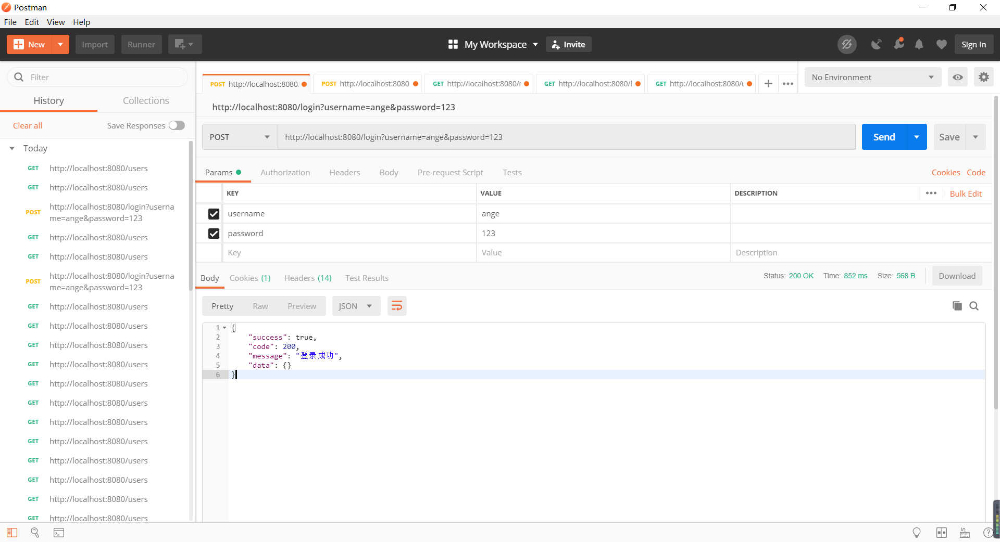

访问：http://localhost:8080/users

发现访问是OK的

再用在线接口测试登录：https://getman.cn/

出现：

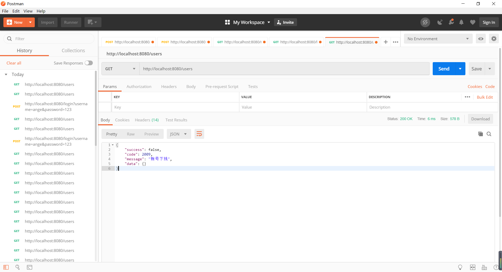

# Method表达式安全控制

如果我们想实现方法级别的安全配置，`Spring Security`提供了四种注解，分别是`@PreAuthorize` , `@PreFilter` , `@PostAuthorize` 和 `@PostFilter`

## 开启方法级别注解的配置

在Spring安全配置代码中，加上EnableGlobalMethodSecurity注解，开启方法级别安全配置功能。

```java
@Configuration
@EnableWebSecurity
@EnableGlobalMethodSecurity(prePostEnabled = true)
public class WebSecurityConfig extends WebSecurityConfigurerAdapter {
    
}
```

## 使用PreAuthorize注解

@PreAuthorize 注解适合进入方法前的权限验证。只有拥有admin角色才能访问menus方法和others方法。

```java
/**
 * 菜单管理
 * @return
 */
@GetMapping("/menus")
@PreAuthorize("hasRole('admin')")
public String menus(){
    return "menus";
}

/**
 * 其他管理
 * @return
 */
@GetMapping("/others")
@PreAuthorize("hasRole('admin')")
public String others(){
    return "others";
}
```

# 数据库设计

```sql
/*
 Navicat MySQL Data Transfer

 Source Server         : niechangan
 Source Server Type    : MySQL
 Source Server Version : 80033
 Source Host           : localhost:3306
 Source Schema         : spring_security

 Target Server Type    : MySQL
 Target Server Version : 80033
 File Encoding         : 65003

 Date: 09/02/2021 23:45:04
*/

SET NAMES utf8mb4;
SET FOREIGN_KEY_CHECKS = 0;

-- ----------------------------
-- Table structure for sys_api
-- ----------------------------
DROP TABLE IF EXISTS `sys_api`;
CREATE TABLE `sys_api`  (
  `id` bigint(45) NOT NULL AUTO_INCREMENT COMMENT '主键',
  `api_name` varchar(45) CHARACTER SET utf8 COLLATE utf8_general_ci NOT NULL COMMENT 'API名称',
  `api_url` varchar(45) CHARACTER SET utf8 COLLATE utf8_general_ci NOT NULL COMMENT 'API请求地址',
  `api_method` varchar(45) CHARACTER SET utf8 COLLATE utf8_general_ci NULL DEFAULT NULL COMMENT 'API请求方式：GET、POST、PUT、DELETE',
  `parent_id` varchar(45) CHARACTER SET utf8 COLLATE utf8_general_ci NULL DEFAULT NULL COMMENT '父ID',
  `api_sort` int(11) NOT NULL COMMENT '排序',
  `create_time` datetime NOT NULL COMMENT '创建时间',
  `update_time` datetime NULL DEFAULT NULL COMMENT '修改时间',
  `available` int(11) NULL DEFAULT 1 COMMENT '0：不可用，1：可用',
  `description` varchar(45) CHARACTER SET utf8 COLLATE utf8_general_ci NULL DEFAULT NULL COMMENT '描述',
  PRIMARY KEY (`id`) USING BTREE
) ENGINE = InnoDB AUTO_INCREMENT = 36 CHARACTER SET = utf8 COLLATE = utf8_general_ci COMMENT = '后台接口表' ROW_FORMAT = DYNAMIC;

-- ----------------------------
-- Records of sys_api
-- ----------------------------
INSERT INTO `sys_api` VALUES (1, '所有API', '/**', 'GET,POST,PUT,DELETE', '0', 1, '2021-03-07 22:16:41', '2021-03-07 22:16:44', 1, '所有API');
INSERT INTO `sys_api` VALUES (2, '用户管理接口', 'none', '', '1', 1, '2021-03-07 22:19:22', '2021-03-07 22:19:09', 1, '用户管理下所有API');
INSERT INTO `sys_api` VALUES (3, '添加用户', '/users/add', 'POST', '2', 1, '2021-03-07 22:20:03', '2021-03-07 22:20:04', 1, NULL);
INSERT INTO `sys_api` VALUES (4, '分配角色', '/users/assignRoles/?', 'POST', '2', 2, '2021-03-07 22:21:00', '2021-03-07 22:21:10', 1, NULL);
INSERT INTO `sys_api` VALUES (5, '删除用户', '/users/delete/?', 'DELETE', '2', 3, '2021-03-07 22:22:19', '2021-03-07 22:22:21', 1, NULL);
INSERT INTO `sys_api` VALUES (6, '编辑用户', '/users/edit/?', 'GET', '2', 4, '2021-03-07 22:24:13', '2021-03-07 22:24:15', 1, NULL);
INSERT INTO `sys_api` VALUES (7, '导出excel', '/users/excel', 'POST', '2', 5, '2021-03-07 22:24:47', '2021-03-07 22:24:49', 1, NULL);
INSERT INTO `sys_api` VALUES (8, '用户信息', '/users/getUserInfo', 'GET', '2', 6, '2021-03-07 22:25:25', '2021-03-07 22:25:28', 1, NULL);
INSERT INTO `sys_api` VALUES (9, '用户列表', '/users/getUserList', 'POST', '2', 7, '2021-03-07 22:25:58', '2021-03-07 22:26:00', 1, NULL);
INSERT INTO `sys_api` VALUES (10, '已有角色', '/users/roles/?', 'GET', '2', 8, '2021-03-07 22:26:31', '2021-03-07 22:26:33', 1, NULL);
INSERT INTO `sys_api` VALUES (11, '更新用户', '/users/update/?', 'PUT', '2', 9, '2021-03-07 22:27:03', '2021-03-07 22:27:03', 1, NULL);
INSERT INTO `sys_api` VALUES (12, '用户状态', '/users/updateStatus/?/?', 'PUT', '2', 10, '2021-03-07 22:27:43', '2021-03-07 22:27:47', 1, NULL);
INSERT INTO `sys_api` VALUES (13, '角色管理接口', 'none', '', '1', 2, '2021-03-07 22:19:22', '2021-03-07 22:19:09', 1, '角色管理下所有API');
INSERT INTO `sys_api` VALUES (14, '添加角色', '/role/add', 'POST', '13', 1, '2021-03-07 22:36:27', '2021-03-07 22:36:29', 1, NULL);
INSERT INTO `sys_api` VALUES (15, '角色授权', '/role/authority/?', 'POST', '13', 2, '2021-03-07 22:37:24', '2021-03-07 22:37:27', 1, NULL);
INSERT INTO `sys_api` VALUES (16, '删除角色', '/role/delete/?', 'DELETE', '13', 3, '2021-03-07 22:39:17', '2021-03-07 22:39:20', 1, NULL);
INSERT INTO `sys_api` VALUES (17, '编辑角色', '/role/edit/?', 'GET', '13', 4, '2021-03-07 22:40:05', '2021-03-07 22:40:07', 1, NULL);
INSERT INTO `sys_api` VALUES (18, '导出excel', '/role/excel', 'POST', '13', 5, '2021-03-07 22:42:36', '2021-03-07 22:42:38', 1, NULL);
INSERT INTO `sys_api` VALUES (19, '角色列表', '/role/findRoleList', 'GET', '13', 6, '2021-03-07 22:43:29', '2021-03-07 22:43:32', 1, NULL);
INSERT INTO `sys_api` VALUES (20, '角色菜单', '/role/findRoleMenu/?', 'GET', '13', 7, '2021-03-07 22:44:04', '2021-03-07 22:44:08', 1, NULL);
INSERT INTO `sys_api` VALUES (21, '更新角色', '/role/update/?', 'PUT', '13', 8, '2021-03-07 22:44:33', '2021-03-07 22:44:35', 1, NULL);
INSERT INTO `sys_api` VALUES (22, '更新状态', '/role/updateStatus/?/?', 'PUT', '13', 9, '2021-03-07 22:45:03', '2021-03-07 22:45:05', 1, NULL);
INSERT INTO `sys_api` VALUES (23, '菜单管理接口', 'none', '', '1', 3, '2021-03-07 22:19:22', '2021-03-07 22:19:09', 1, '菜单管理下所有API');
INSERT INTO `sys_api` VALUES (24, '新增菜单', '/menu/addMenu', 'POST', '23', 1, '2021-03-07 22:47:13', '2021-03-07 22:47:15', 1, NULL);
INSERT INTO `sys_api` VALUES (25, '删除菜单', '/menu/delete/?', 'DELETE', '23', 2, '2021-03-07 22:47:47', '2021-03-07 22:47:49', 1, NULL);
INSERT INTO `sys_api` VALUES (26, '菜单详情', '/menu/edit/?', 'GET', '23', 3, '2021-03-07 22:48:40', '2021-03-07 22:48:42', 1, NULL);
INSERT INTO `sys_api` VALUES (27, '导出excel', '/menu/excel', 'POST', '23', 4, '2021-03-07 22:49:13', '2021-03-07 22:49:15', 1, NULL);
INSERT INTO `sys_api` VALUES (28, '加载菜单树 ', '/menu/getTree', 'GET', '23', 5, '2021-03-07 22:49:45', '2021-03-07 22:49:47', 1, NULL);
INSERT INTO `sys_api` VALUES (29, '更新菜单', '/menu/update/?', 'PUT', '23', 6, '2021-03-07 22:50:14', '2021-03-07 22:50:16', 1, NULL);
INSERT INTO `sys_api` VALUES (30, 'API管理接口', 'none', '', '1', 4, '2021-03-07 22:19:22', '2021-03-07 22:19:09', 1, '菜单管理下所有API');
INSERT INTO `sys_api` VALUES (31, '新增API', '/api/addApi', 'POST', '30', 1, '2021-03-07 22:47:13', '2021-03-07 22:47:15', 1, NULL);
INSERT INTO `sys_api` VALUES (32, '删除API', '/api/delete/?', 'DELETE', '30', 2, '2021-03-07 22:47:47', '2021-03-07 22:47:49', 1, NULL);
INSERT INTO `sys_api` VALUES (33, 'API详情', '/api/edit/?', 'GET', '30', 3, '2021-03-07 22:48:40', '2021-03-07 22:48:42', 1, NULL);
INSERT INTO `sys_api` VALUES (34, '导出excel', '/api/excel', 'POST', '30', 4, '2021-03-07 22:49:13', '2021-03-07 22:49:15', 1, NULL);
INSERT INTO `sys_api` VALUES (35, '加载API树 ', '/api/getTree', 'GET', '30', 5, '2021-03-07 22:49:45', '2021-03-07 22:49:47', 1, NULL);
INSERT INTO `sys_api` VALUES (36, '更新API', '/api/update/?', 'PUT', '30', 6, '2021-03-07 22:50:14', '2021-03-07 22:50:16', 1, NULL);

-- ----------------------------
-- Table structure for sys_menu
-- ----------------------------
DROP TABLE IF EXISTS `sys_menu`;
CREATE TABLE `sys_menu`  (
  `id` bigint(20) NOT NULL AUTO_INCREMENT COMMENT '菜单/按钮ID',
  `parent_id` bigint(20) NULL DEFAULT NULL COMMENT '上级菜单ID',
  `menu_name` varchar(50) CHARACTER SET utf8 COLLATE utf8_general_ci NOT NULL COMMENT '菜单/按钮名称',
  `router_url` varchar(50) CHARACTER SET utf8 COLLATE utf8_general_ci NULL DEFAULT NULL COMMENT '前端菜单路由URL',
  `perms` text CHARACTER SET utf8 COLLATE utf8_general_ci NULL COMMENT '权限标识',
  `icon` varchar(50) CHARACTER SET utf8 COLLATE utf8_general_ci NULL DEFAULT NULL COMMENT '图标',
  `type` char(2) CHARACTER SET utf8 COLLATE utf8_general_ci NOT NULL COMMENT '类型 0菜单 1按钮',
  `order_num` bigint(20) NULL DEFAULT NULL COMMENT '排序',
  `create_time` datetime NOT NULL COMMENT '创建时间',
  `update_time` datetime NULL DEFAULT NULL COMMENT '修改时间',
  `available` int(11) NULL DEFAULT 1 COMMENT '0：不可用，1：可用',
  `open` int(1) NULL DEFAULT 1 COMMENT '0:不展开，1：展开',
  PRIMARY KEY (`id`) USING BTREE
) ENGINE = InnoDB AUTO_INCREMENT = 330 CHARACTER SET = utf8 COLLATE = utf8_general_ci COMMENT = '菜单表' ROW_FORMAT = DYNAMIC;

-- ----------------------------
-- Records of sys_menu
-- ----------------------------
INSERT INTO `sys_menu` VALUES (1, 0, '系统管理', NULL, NULL, 'el-icon-setting', '0', 1, '2021-03-07 21:33:05', '2021-03-07 21:33:08', 1, 1);
INSERT INTO `sys_menu` VALUES (2, 1, '用户管理', '/users', '', 'el-icon-user', '0', 1, '2021-03-07 21:35:03', '2021-03-07 21:35:03', 1, 1);
INSERT INTO `sys_menu` VALUES (3, 2, '用户添加', NULL, 'user:add', 'el-icon-plus', '1', NULL, '2021-03-07 21:40:40', '2021-03-07 21:40:42', 1, 0);
INSERT INTO `sys_menu` VALUES (4, 2, '用户删除', NULL, 'user:delete', 'el-icon-picture', '1', NULL, '2021-03-07 21:42:09', '2021-03-07 21:42:12', 1, 0);
INSERT INTO `sys_menu` VALUES (5, 2, '用户编辑', NULL, 'user:edit', 'el-icon-video-camera-solid', '1', NULL, '2021-03-07 21:42:54', '2021-03-07 21:42:56', 1, 0);
INSERT INTO `sys_menu` VALUES (6, 2, '分配角色', NULL, 'user:assign', 'el-icon-s-tools', '1', NULL, '2021-03-07 21:44:09', '2021-03-07 21:44:11', 1, 0);
INSERT INTO `sys_menu` VALUES (7, 2, '禁用用户', NULL, 'user:status', 'el-icon-circle-close', '1', NULL, '2021-03-07 21:44:46', '2021-03-07 21:44:48', 1, 0);
INSERT INTO `sys_menu` VALUES (8, 2, '用户更新', NULL, 'user:update', 'el-icon-refresh', '1', NULL, '2021-03-07 21:46:14', '2021-03-07 21:46:16', 1, 0);
INSERT INTO `sys_menu` VALUES (9, 2, '导出表格', NULL, 'user:export', 'el-icon-edit', '1', NULL, '2021-03-07 21:46:59', '2021-03-07 21:47:02', 1, 0);
INSERT INTO `sys_menu` VALUES (10, 1, '角色管理', '/roles', '', 'el-icon-postcard', '0', 2, '2020-03-10 05:51:28', '2020-05-16 16:37:58', 1, 1);
INSERT INTO `sys_menu` VALUES (11, 10, '角色编辑', '', 'role:edit', 'el-icon-s-promotion', '1', NULL, '2020-03-10 06:11:03', '2020-03-11 11:40:19', 1, 0);
INSERT INTO `sys_menu` VALUES (12, 10, '角色删除', '', 'role:delete', 'el-icon-s-marketing', '1', NULL, '2020-03-10 06:15:29', '2020-03-11 11:43:36', 1, 0);
INSERT INTO `sys_menu` VALUES (13, 10, '分配权限', '', 'role:authority', 'el-icon-document-add', '1', NULL, '2020-03-10 08:13:22', '2020-03-11 11:39:30', 1, 0);
INSERT INTO `sys_menu` VALUES (14, 10, '添加角色', '', 'role:add', 'el-icon-help', '1', NULL, '2020-03-11 03:34:18', '2020-03-11 03:34:18', 1, 0);
INSERT INTO `sys_menu` VALUES (15, 10, '角色更新', '', 'role:update', 'el-icon-refresh-left', '1', NULL, '2020-03-11 11:45:20', '2020-03-11 11:45:20', 1, 0);
INSERT INTO `sys_menu` VALUES (16, 10, '状态更新', '', 'role:status', 'el-icon-refresh', '1', NULL, '2020-03-14 05:07:02', '2020-03-14 05:07:24', 1, 0);
INSERT INTO `sys_menu` VALUES (17, 1, '菜单管理', '/menus', NULL, 'el-icon-menu', '0', 3, '2020-03-07 18:57:42', '2020-03-20 11:50:46', 1, 1);
INSERT INTO `sys_menu` VALUES (18, 17, '添加菜单', '', 'menu:add', 'el-icon-s-opportunity', '1', NULL, '2020-03-10 07:55:10', '2020-04-27 09:59:43', 1, 0);
INSERT INTO `sys_menu` VALUES (19, 17, '修改菜单', '', 'menu:update', 'el-icon-share', '1', NULL, '2020-03-10 07:56:55', '2020-03-15 13:29:29', 1, 0);
INSERT INTO `sys_menu` VALUES (20, 17, '删除菜单', '', 'menu:delete', 'el-icon-folder-opened', '1', NULL, '2020-03-10 07:57:38', '2020-03-15 13:29:41', 1, 0);
INSERT INTO `sys_menu` VALUES (21, 17, '编辑菜单', '', 'menu:edit', 'el-icon-edit', '1', NULL, '2020-03-22 23:12:25', '2020-03-22 23:12:25', 1, 0);
INSERT INTO `sys_menu` VALUES (22, 17, '导出菜单', NULL, 'menu:export', 'el-icon-edit', '1', NULL, '2020-04-27 17:26:40', '2020-04-27 17:26:40', 1, 0);
INSERT INTO `sys_menu` VALUES (23, 1, 'API管理', '/apis', NULL, 'el-icon-document', '0', 4, '2020-03-07 18:57:42', '2020-03-20 11:50:46', 1, 1);
INSERT INTO `sys_menu` VALUES (24, 23, '添加API', NULL, 'api:add', 'el-icon-s-opportunity', '1', NULL, '2021-03-07 22:07:14', '2021-03-07 22:07:17', 1, 0);
INSERT INTO `sys_menu` VALUES (25, 23, '修改API', NULL, 'api:update', 'el-icon-share', '1', NULL, '2021-03-07 22:07:57', '2021-03-07 22:07:59', 1, 0);
INSERT INTO `sys_menu` VALUES (26, 23, '删除API', NULL, 'api:delete', 'el-icon-folder-opened', '1', NULL, '2021-03-07 22:08:57', '2021-03-07 22:08:59', 1, 0);
INSERT INTO `sys_menu` VALUES (27, 23, '编辑API', NULL, 'api:edit', 'el-icon-edit', '1', NULL, '2021-03-07 22:09:54', '2021-03-07 22:09:56', 1, 0);

-- ----------------------------
-- Table structure for sys_role
-- ----------------------------
DROP TABLE IF EXISTS `sys_role`;
CREATE TABLE `sys_role`  (
  `id` bigint(20) NOT NULL AUTO_INCREMENT COMMENT '角色ID',
  `role_code` varchar(100) CHARACTER SET utf8 COLLATE utf8_general_ci NOT NULL COMMENT '角色编码',
  `role_name` varchar(100) CHARACTER SET utf8 COLLATE utf8_general_ci NOT NULL COMMENT '角色名称',
  `create_time` datetime NOT NULL COMMENT '创建时间',
  `update_time` datetime NULL DEFAULT NULL COMMENT '修改时间',
  `enabled` int(1) NULL DEFAULT 1 COMMENT '是否可用,0:不可用，1：可用',
  `description` varchar(100) CHARACTER SET utf8 COLLATE utf8_general_ci NULL DEFAULT NULL COMMENT '角色描述',
  PRIMARY KEY (`id`) USING BTREE
) ENGINE = InnoDB AUTO_INCREMENT = 3 CHARACTER SET = utf8 COLLATE = utf8_general_ci COMMENT = '角色表' ROW_FORMAT = DYNAMIC;

-- ----------------------------
-- Records of sys_role
-- ----------------------------
INSERT INTO `sys_role` VALUES (1, 'admin', '超级管理员', '2021-03-07 21:25:18', '2021-03-07 21:25:20', 1, NULL);
INSERT INTO `sys_role` VALUES (2, 'teacher', '老师', '2021-03-07 21:25:49', '2021-03-07 21:25:51', 1, NULL);
INSERT INTO `sys_role` VALUES (3, 'student', '学生', '2021-03-07 21:26:42', '2021-03-07 21:26:45', 1, NULL);

-- ----------------------------
-- Table structure for sys_role_api
-- ----------------------------
DROP TABLE IF EXISTS `sys_role_api`;
CREATE TABLE `sys_role_api`  (
  `id` bigint(11) NOT NULL AUTO_INCREMENT COMMENT '主键',
  `role_id` varchar(45) CHARACTER SET utf8 COLLATE utf8_general_ci NOT NULL COMMENT '角色ID',
  `api_id` varchar(45) CHARACTER SET utf8 COLLATE utf8_general_ci NOT NULL COMMENT 'API管理表ID',
  `create_time` datetime NOT NULL COMMENT '创建时间',
  `update_time` datetime NULL DEFAULT NULL COMMENT '修改时间',
  PRIMARY KEY (`id`) USING BTREE
) ENGINE = InnoDB AUTO_INCREMENT = 46 CHARACTER SET = utf8 COLLATE = utf8_general_ci COMMENT = '角色接口表' ROW_FORMAT = DYNAMIC;

-- ----------------------------
-- Records of sys_role_api
-- ----------------------------
INSERT INTO `sys_role_api` VALUES (1, '1', '1', '2021-03-07 22:16:41', '2021-03-07 22:16:44');
INSERT INTO `sys_role_api` VALUES (2, '1', '2', '2021-03-07 22:19:22', '2021-03-07 22:19:09');
INSERT INTO `sys_role_api` VALUES (3, '1', '3', '2021-03-07 22:20:03', '2021-03-07 22:20:04');
INSERT INTO `sys_role_api` VALUES (4, '1', '4', '2021-03-07 22:21:00', '2021-03-07 22:21:10');
INSERT INTO `sys_role_api` VALUES (5, '1', '5', '2021-03-07 22:22:19', '2021-03-07 22:22:21');
INSERT INTO `sys_role_api` VALUES (6, '1', '6', '2021-03-07 22:24:13', '2021-03-07 22:24:15');
INSERT INTO `sys_role_api` VALUES (7, '1', '7', '2021-03-07 22:24:47', '2021-03-07 22:24:49');
INSERT INTO `sys_role_api` VALUES (8, '1', '8', '2021-03-07 22:25:25', '2021-03-07 22:25:28');
INSERT INTO `sys_role_api` VALUES (9, '1', '9', '2021-03-07 22:25:58', '2021-03-07 22:26:00');
INSERT INTO `sys_role_api` VALUES (10, '1', '10', '2021-03-07 22:26:31', '2021-03-07 22:26:33');
INSERT INTO `sys_role_api` VALUES (11, '1', '11', '2021-03-07 22:27:03', '2021-03-07 22:27:03');
INSERT INTO `sys_role_api` VALUES (12, '1', '12', '2021-03-07 22:27:43', '2021-03-07 22:27:47');
INSERT INTO `sys_role_api` VALUES (13, '1', '13', '2021-03-07 22:19:22', '2021-03-07 22:19:09');
INSERT INTO `sys_role_api` VALUES (14, '1', '14', '2021-03-07 22:36:27', '2021-03-07 22:36:29');
INSERT INTO `sys_role_api` VALUES (15, '1', '15', '2021-03-07 22:37:24', '2021-03-07 22:37:27');
INSERT INTO `sys_role_api` VALUES (16, '1', '16', '2021-03-07 22:39:17', '2021-03-07 22:39:20');
INSERT INTO `sys_role_api` VALUES (17, '1', '17', '2021-03-07 22:40:05', '2021-03-07 22:40:07');
INSERT INTO `sys_role_api` VALUES (18, '1', '18', '2021-03-07 22:42:36', '2021-03-07 22:42:38');
INSERT INTO `sys_role_api` VALUES (19, '1', '19', '2021-03-07 22:43:29', '2021-03-07 22:43:32');
INSERT INTO `sys_role_api` VALUES (20, '1', '20', '2021-03-07 22:44:04', '2021-03-07 22:44:08');
INSERT INTO `sys_role_api` VALUES (21, '1', '21', '2021-03-07 22:44:33', '2021-03-07 22:44:35');
INSERT INTO `sys_role_api` VALUES (22, '1', '22', '2021-03-07 22:45:03', '2021-03-07 22:45:05');
INSERT INTO `sys_role_api` VALUES (23, '1', '23', '2021-03-07 22:19:22', '2021-03-07 22:19:09');
INSERT INTO `sys_role_api` VALUES (24, '1', '24', '2021-03-07 22:47:13', '2021-03-07 22:47:15');
INSERT INTO `sys_role_api` VALUES (25, '1', '25', '2021-03-07 22:47:47', '2021-03-07 22:47:49');
INSERT INTO `sys_role_api` VALUES (26, '1', '26', '2021-03-07 22:48:40', '2021-03-07 22:48:42');
INSERT INTO `sys_role_api` VALUES (27, '1', '27', '2021-03-07 22:49:13', '2021-03-07 22:49:15');
INSERT INTO `sys_role_api` VALUES (28, '1', '28', '2021-03-07 22:49:45', '2021-03-07 22:49:47');
INSERT INTO `sys_role_api` VALUES (29, '1', '29', '2021-03-07 22:50:14', '2021-03-07 22:50:16');
INSERT INTO `sys_role_api` VALUES (30, '1', '30', '2021-03-07 22:19:22', '2021-03-07 22:19:09');
INSERT INTO `sys_role_api` VALUES (31, '1', '31', '2021-03-07 22:47:13', '2021-03-07 22:47:15');
INSERT INTO `sys_role_api` VALUES (32, '1', '32', '2021-03-07 22:47:47', '2021-03-07 22:47:49');
INSERT INTO `sys_role_api` VALUES (33, '1', '33', '2021-03-07 22:48:40', '2021-03-07 22:48:42');
INSERT INTO `sys_role_api` VALUES (34, '1', '34', '2021-03-07 22:49:13', '2021-03-07 22:49:15');
INSERT INTO `sys_role_api` VALUES (35, '1', '35', '2021-03-07 22:49:45', '2021-03-07 22:49:47');
INSERT INTO `sys_role_api` VALUES (36, '1', '36', '2021-03-07 22:50:14', '2021-03-07 22:50:16');

-- ----------------------------
-- Table structure for sys_role_menu
-- ----------------------------
DROP TABLE IF EXISTS `sys_role_menu`;
CREATE TABLE `sys_role_menu`  (
  `id` bigint(10) NOT NULL AUTO_INCREMENT COMMENT '主键',
  `role_id` bigint(20) NOT NULL COMMENT '角色ID',
  `menu_id` bigint(20) NOT NULL COMMENT '菜单/按钮ID',
  `create_time` datetime NULL DEFAULT NULL COMMENT '创建时间',
  `update_time` datetime NULL DEFAULT NULL COMMENT '更新时间',
  PRIMARY KEY (`id`) USING BTREE
) ENGINE = InnoDB AUTO_INCREMENT = 27 CHARACTER SET = utf8 COLLATE = utf8_general_ci COMMENT = '角色菜单关联表' ROW_FORMAT = DYNAMIC;

-- ----------------------------
-- Records of sys_role_menu
-- ----------------------------
INSERT INTO `sys_role_menu` VALUES (1, 1, 1, '2021-03-07 22:16:41', '2021-03-07 22:16:41');
INSERT INTO `sys_role_menu` VALUES (2, 1, 2, '2021-03-07 22:19:22', '2021-03-07 22:19:22');
INSERT INTO `sys_role_menu` VALUES (3, 1, 3, '2021-03-07 22:20:03', '2021-03-07 22:20:03');
INSERT INTO `sys_role_menu` VALUES (4, 1, 4, '2021-03-07 22:21:00', '2021-03-07 22:21:00');
INSERT INTO `sys_role_menu` VALUES (5, 1, 5, '2021-03-07 22:22:19', '2021-03-07 22:22:19');
INSERT INTO `sys_role_menu` VALUES (6, 1, 6, '2021-03-07 22:24:13', '2021-03-07 22:24:13');
INSERT INTO `sys_role_menu` VALUES (7, 1, 7, '2021-03-07 22:24:47', '2021-03-07 22:24:47');
INSERT INTO `sys_role_menu` VALUES (8, 1, 8, '2021-03-07 22:25:25', '2021-03-07 22:25:25');
INSERT INTO `sys_role_menu` VALUES (9, 1, 9, '2021-03-07 22:25:58', '2021-03-07 22:25:58');
INSERT INTO `sys_role_menu` VALUES (10, 1, 10, '2021-03-07 22:26:31', '2021-03-07 22:26:31');
INSERT INTO `sys_role_menu` VALUES (11, 1, 11, '2021-03-07 22:27:03', '2021-03-07 22:27:03');
INSERT INTO `sys_role_menu` VALUES (12, 1, 12, '2021-03-07 22:27:43', '2021-03-07 22:27:43');
INSERT INTO `sys_role_menu` VALUES (13, 1, 13, '2021-03-07 22:19:22', '2021-03-07 22:19:22');
INSERT INTO `sys_role_menu` VALUES (14, 1, 14, '2021-03-07 22:36:27', '2021-03-07 22:36:27');
INSERT INTO `sys_role_menu` VALUES (15, 1, 15, '2021-03-07 22:37:24', '2021-03-07 22:37:24');
INSERT INTO `sys_role_menu` VALUES (16, 1, 16, '2021-03-07 22:39:17', '2021-03-07 22:39:17');
INSERT INTO `sys_role_menu` VALUES (17, 1, 17, '2021-03-07 22:40:05', '2021-03-07 22:40:05');
INSERT INTO `sys_role_menu` VALUES (18, 1, 18, '2021-03-07 22:42:36', '2021-03-07 22:42:36');
INSERT INTO `sys_role_menu` VALUES (19, 1, 19, '2021-03-07 22:43:29', '2021-03-07 22:43:29');
INSERT INTO `sys_role_menu` VALUES (20, 1, 20, '2021-03-07 22:44:04', '2021-03-07 22:44:04');
INSERT INTO `sys_role_menu` VALUES (21, 1, 21, '2021-03-07 22:44:33', '2021-03-07 22:44:33');
INSERT INTO `sys_role_menu` VALUES (22, 1, 22, '2021-03-07 22:45:03', '2021-03-07 22:45:03');
INSERT INTO `sys_role_menu` VALUES (23, 1, 23, '2021-03-07 22:19:22', '2021-03-07 22:19:22');
INSERT INTO `sys_role_menu` VALUES (24, 1, 24, '2021-03-07 22:47:13', '2021-03-07 22:47:13');
INSERT INTO `sys_role_menu` VALUES (25, 1, 25, '2021-03-07 22:47:47', '2021-03-07 22:47:47');
INSERT INTO `sys_role_menu` VALUES (26, 1, 26, '2021-03-07 22:48:40', '2021-03-07 22:48:40');
INSERT INTO `sys_role_menu` VALUES (27, 1, 27, '2021-03-07 22:49:13', '2021-03-07 22:49:13');

-- ----------------------------
-- Table structure for sys_user
-- ----------------------------
DROP TABLE IF EXISTS `sys_user`;
CREATE TABLE `sys_user`  (
  `id` bigint(20) NOT NULL AUTO_INCREMENT COMMENT '用户ID',
  `username` varchar(50) CHARACTER SET utf8 COLLATE utf8_general_ci NOT NULL COMMENT '用户名',
  `password` varchar(128) CHARACTER SET utf8 COLLATE utf8_general_ci NOT NULL COMMENT '密码',
  `nickname` varchar(20) CHARACTER SET utf8 COLLATE utf8_general_ci NULL DEFAULT NULL COMMENT '昵称',
  `email` varchar(128) CHARACTER SET utf8 COLLATE utf8_general_ci NULL DEFAULT NULL COMMENT '邮箱',
  `avatar` text CHARACTER SET utf8 COLLATE utf8_general_ci NULL COMMENT '头像',
  `phone_number` varchar(20) CHARACTER SET utf8 COLLATE utf8_general_ci NULL DEFAULT NULL COMMENT '联系电话',
  `enabled` int(1) NOT NULL COMMENT '账户是否禁用 默认为1（可用）',
  `create_time` datetime NOT NULL COMMENT '创建时间',
  `update_time` datetime NULL DEFAULT NULL COMMENT '修改时间',
  `sex` int(1) NULL DEFAULT NULL COMMENT '性别 1男 0女 2保密',
  `type` int(11) NOT NULL DEFAULT 1 COMMENT '0:超级管理员，1：系统用户',
  `birth` date NULL DEFAULT NULL COMMENT '生日',
  `last_login_time` datetime NULL DEFAULT NULL COMMENT '最后一次登录时间',
  `token` varchar(256) CHARACTER SET utf8 COLLATE utf8_general_ci NULL DEFAULT NULL COMMENT 'token令牌',
  PRIMARY KEY (`id`) USING BTREE
) ENGINE = InnoDB AUTO_INCREMENT = 8 CHARACTER SET = utf8 COLLATE = utf8_general_ci COMMENT = '用户表' ROW_FORMAT = DYNAMIC;

-- ----------------------------
-- Records of sys_user
-- ----------------------------
INSERT INTO `sys_user` VALUES (1, 'admin', '$2a$10$z9kizbquVHRNk1jEdGy7suTI3JxWBCnXOd6GkLg.RmZQszZRxD26.', '超级管理员', '1351261434@qq.com', 'https://xinguan-parent.oss-cn-hangzhou.aliyuncs.com/2020/10/23/327fdad160b840f8b14611f4d00d94bd.png', '17675753912', 1, '2020-12-28 15:51:23', '2020-12-28 15:51:23', 1, 0, '1998-04-22', NULL, '');
INSERT INTO `sys_user` VALUES (2, 'niechangan', '$2a$10$MjeE7I6gJO6pgAcZn4AOlOTWMQoKeu5jmnAoylgrw4usoAB8HoGiW', '聂长安', '1351261434@qq.com', 'https://xinguan-parent.oss-cn-hangzhou.aliyuncs.com/2020/10/23/327fdad160b840f8b14611f4d00d94bd.png', '17675753912', 1, '2021-03-07 21:17:47', '2021-03-07 21:17:47', 1, 1, '1999-04-22', NULL, NULL);
INSERT INTO `sys_user` VALUES (3, 'test', '$2a$10$MtuhoRzKwr.wM71paPzYLO.8l2ADCWsm1Z5o0jjHn1bjgQrkP6.xe', '测试用户', '1351261434@qq.com', 'https://xinguan-parent.oss-cn-hangzhou.aliyuncs.com/2020/10/23/327fdad160b840f8b14611f4d00d94bd.png', '17675753912', 1, '2020-12-28 15:51:50', '2020-12-28 15:51:50', 1, 1, '1999-04-22', NULL, '');
INSERT INTO `sys_user` VALUES (4, 'xiaoge', '$2a$10$2NwLFBb2k9B60yqawlHAZebdXxgL8UktSwDVcgUYA0RO5JOQIJfWG', '小哥', '1351261434@qq.com', 'https://xinguan-parent.oss-cn-hangzhou.aliyuncs.com/2020/10/23/327fdad160b840f8b14611f4d00d94bd.png', '17675753912', 1, '2020-12-28 15:48:31', '2020-12-28 15:48:31', 1, 1, '1993-04-22', NULL, '');

-- ----------------------------
-- Table structure for sys_user_role
-- ----------------------------
DROP TABLE IF EXISTS `sys_user_role`;
CREATE TABLE `sys_user_role`  (
  `id` bigint(10) NOT NULL AUTO_INCREMENT COMMENT '主键',
  `role_id` bigint(10) NULL DEFAULT NULL COMMENT '角色ID',
  `user_id` bigint(10) NULL DEFAULT NULL COMMENT '用户ID',
  `create_time` datetime NULL DEFAULT NULL COMMENT '创建时间',
  `update_time` datetime NULL DEFAULT NULL COMMENT '更新时间',
  PRIMARY KEY (`id`) USING BTREE
) ENGINE = InnoDB CHARACTER SET = utf8 COLLATE = utf8_general_ci COMMENT = '系统管理 - 用户角色关联表 ' ROW_FORMAT = DYNAMIC;

-- ----------------------------
-- Records of sys_user_role
-- ----------------------------
INSERT INTO `sys_user_role` VALUES (1, 1, 1, '2021-03-07 21:29:22', '2021-03-07 21:29:25');
INSERT INTO `sys_user_role` VALUES (2, 2, 2, '2021-03-07 21:29:42', '2021-03-07 21:29:44');
INSERT INTO `sys_user_role` VALUES (3, 3, 3, '2021-03-07 21:30:06', '2021-03-07 21:30:10');
INSERT INTO `sys_user_role` VALUES (4, 3, 4, '2021-03-07 21:30:22', '2021-03-07 21:30:25');

SET FOREIGN_KEY_CHECKS = 1;
```

# 接口数据

==SysApiController==

```java
@CrossOrigin
@RestController
@RequestMapping("/api")
@Api(value = "系统API模块", tags = "API权限接口")
public class SysApiController {

    /**
     * 加载菜单树
     *
     * @return
     */
    @ApiOperation(value = "加载API树", notes = "获取所有菜单树，以及展开项")
    @GetMapping("/getTree")
    public Result tree() {
        return Result.ok();
    }

    /**
     * 新增菜单/按钮
     *
     * @return
     */
    @ApiOperation(value = "新增API")
    @PreAuthorize("hasAuthority('api:add')")
    @PostMapping("/addApi")
    public Result addApi(@RequestBody SysApi sysApi) {
        return Result.ok();
    }

    /**
     * 删除菜单/按钮
     *
     * @param id
     * @return
     */
    @ApiOperation(value = "删除API", notes = "根据id删除API节点")
    @PreAuthorize("hasAuthority('api:delete')")
    @DeleteMapping("/delete/{id}")
    public Result delete(@PathVariable Long id) {
        return Result.ok();
    }

    /**
     * 根据id编辑菜单，获取菜单详情
     *
     * @param id
     * @return
     */
    @ApiOperation(value = "API详情", notes = "根据id编辑API，获取API详情")
    @PreAuthorize("hasAuthority('api:edit')")
    @GetMapping("/edit/{id}")
    public Result edit(@PathVariable Long id) {
        return Result.ok();
    }

    /**
     * 更新菜单
     *
     * @param id
     * @param sysApi
     * @return
     */
    @ApiOperation(value = "更新API", notes = "根据id更新API节点")
    @PreAuthorize("hasAuthority('api:update')")
    @PutMapping("/update/{id}")
    public Result update(@PathVariable Long id, @RequestBody SysApi sysApi) {
        return Result.ok();
    }

    /**
     * 导出excel
     * @param response
     */
    @ApiOperation(value = "导出excel", notes = "导出所有API的excel表格")
    @PreAuthorize("hasAuthority('api:export')")
    @PostMapping("excel")
    public Result export(HttpServletResponse response) {
        return Result.ok();
    }
}
```

==SysMenuController==

```java
@CrossOrigin
@RestController
@RequestMapping("/menu")
@Api(value = "系统菜单模块", tags = "菜单权限接口")
public class SysMenuController {

    @Autowired
    private SysMenuService sysMenuService;

    /**
     * 加载菜单树
     *
     * @return
     */
    @ApiOperation(value = "加载菜单树", notes = "获取所有菜单树，以及展开项")
    @GetMapping("/getTree")
    public Result tree() {
        return Result.ok();
    }

    /**
     * 新增菜单/按钮
     *
     * @return
     */
    @ApiOperation(value = "新增菜单")
    @PreAuthorize("hasAuthority('menu:add')")
    @PostMapping("/addMenu")
    public Result addMenu(@RequestBody SysMenu sysMenu) {
        return Result.ok();
    }

    /**
     * 删除菜单/按钮
     *
     * @param id
     * @return
     */
    @ApiOperation(value = "删除菜单", notes = "根据id删除菜单节点")
    @PreAuthorize("hasAuthority('menu:delete')")
    @DeleteMapping("/delete/{id}")
    public Result delete(@PathVariable Long id) {
        return Result.ok();
    }

    /**
     * 根据id编辑菜单，获取菜单详情
     *
     * @param id
     * @return
     */
    @ApiOperation(value = "菜单详情", notes = "根据id编辑菜单，获取菜单详情")
    @PreAuthorize("hasAuthority('menu:edit')")
    @GetMapping("/edit/{id}")
    public Result edit(@PathVariable Long id) {
        return Result.ok();
    }

    /**
     * 更新菜单
     *
     * @param id
     * @param sysMenu
     * @return
     */
    @ApiOperation(value = "更新菜单", notes = "根据id更新菜单节点")
    @PreAuthorize("hasAuthority('menu:update')")
    @PutMapping("/update/{id}")
    public Result update(@PathVariable Long id, @RequestBody SysMenu sysMenu) {
        return Result.ok();
    }

    /**
     * 导出excel
     * @param response
     */
    @ApiOperation(value = "导出excel", notes = "导出所有菜单的excel表格")
    @PreAuthorize("hasAuthority('menu:export')")
    @PostMapping("excel")
    public Result export(HttpServletResponse response) {
        return Result.ok();
    }
}
```

==SysRoleController==

```java
@CrossOrigin
@RestController
@RequestMapping("/role")
@Api(value = "系统角色模块", tags = "系统角色接口")
public class SysRoleController {

    @ApiOperation(value = "角色授权")
    @PreAuthorize("hasAuthority('role:authority')")
    @PostMapping("/authority/{id}")
    public Result authority(@PathVariable Long id, @RequestBody Long[] mids){

        return Result.ok();
    }

    /**
     * 角色拥有的菜单权限id和菜单树
     * @return
     */
    @ApiOperation(value = "角色菜单")
    @GetMapping("/findRoleMenu/{id}")
    public Result findRoleMenu(){


        return Result.ok();
    }

    /**
     * 分页查询角色列表
     *
     * @return
     */
    @ApiOperation(value = "角色列表",notes = "分页查询角色列表信息")
    @GetMapping("/findRoleList")
    public Result findRoleList(@RequestParam(value = "current", defaultValue = "1") Integer current,
                               @RequestParam(value = "size", defaultValue = "7") Integer size,
                               SysRole sysRole){

        return Result.ok();
    }

    /**
     * 添加角色信息
     *
     * @param sysRole
     * @return
     */
    @ApiOperation(value = "添加角色")
    @PreAuthorize("hasAuthority('role:add')")
    @PostMapping("/add")
    public Result add(@RequestBody SysRole sysRole) {
        return Result.ok();
    }

    /**
     * 删除角色
     *
     * @param id 角色ID
     * @return
     */
    @ApiOperation(value = "删除角色", notes = "根据id删除角色信息")
    @PreAuthorize("hasAuthority('role:delete')")
    @DeleteMapping("/delete/{id}")
    public Result delete(@PathVariable Long id) {
        return Result.ok();
    }

    /**
     * 编辑角色信息(根据角色ID查询角色信息)
     *
     * @param id
     * @return
     */
    @ApiOperation(value = "编辑角色", notes = "根据id更新角色信息")
    @PreAuthorize("hasAuthority('role:edit')")
    @GetMapping("/edit/{id}")
    public Result edit(@PathVariable Long id) {
        return Result.ok();
    }

    /**
     * 更新角色
     *
     * @param id
     * @param sysRole
     * @return
     */
    @ApiOperation(value = "更新角色", notes = "根据id更新角色信息")
    @PreAuthorize("hasAuthority('role:update')")
    @PutMapping("/update/{id}")
    public Result update(@PathVariable Long id, @RequestBody SysRole sysRole) {
        return Result.ok();
    }

    /**
     * 更新角色状态
     *
     * @param id
     * @param status
     * @return
     */
    @ApiOperation(value = "更新状态", notes = "禁用和更新两种状态")
    @PreAuthorize("hasAuthority('role:status')")
    @PutMapping("/updateStatus/{id}/{status}")
    public Result updateStatus(@PathVariable Long id, @PathVariable Boolean status) {
        return Result.ok();
    }

    /**
     * 导出excel
     * @param response
     */
    @ApiOperation(value = "导出excel", notes = "导出所有角色的excel表格")
    @PostMapping("/excel")
    @PreAuthorize("hasAuthority('role:export')")
    public Result export(HttpServletResponse response) {
        return Result.ok();
    }
}
```

==SysUserController==

```java
@CrossOrigin
@RestController
@RequestMapping("/users")
@Api(value = "系统用户模块", tags = "系统用户接口")
public class SysUserController {

    @Autowired
    private SysUserService sysUserService;

    @Autowired
    private SysRoleService sysRoleService;

    /**
     * 获取用户列表
     * @return
     */
    @ApiOperation(value = "用户列表", notes = "模糊查询用户列表")
    @PostMapping("/getUserList")
    public Result getUserList(@RequestParam(value = "current", defaultValue = "1") Integer current,
                              @RequestParam(value = "size", defaultValue = "7") Integer size,
                              @RequestBody UserVO userVO){
        return Result.ok();
    }

    /**
     * 获取用户信息
     *
     * @return
     */
    @ApiOperation(value = "用户信息", notes = "用户登入信息")
    @GetMapping("/getUserInfo")
    public Result info() {
        return Result.ok();
    }

    /**
     * 分配角色
     *
     * @param id 用户id
     * @param rids 角色id的数组
     * @return
     */
    @ApiOperation(value = "分配角色", notes = "给用户分配角色")
    @PreAuthorize("hasAuthority('user:assign')")
    @PostMapping("/assignRoles/{id}")
    public Result assignRoles(@PathVariable Long id, @RequestBody Long[] rids) {
        return Result.ok();
    }

    /**
     * 删除用户
     *
     * @param id 用户ID
     * @return
     */
    @PreAuthorize("hasAuthority('user:delete')")
    @ApiOperation(value = "删除用户", notes = "删除用户信息，根据用户ID")
    @DeleteMapping("/delete/{id}")
    public Result delete(@PathVariable Long id) {

        return Result.ok();
    }

    /**
     * 更新状态
     *
     * @param id
     * @param status
     * @return
     */
    @ApiOperation(value = "用户状态", notes = "禁用和启用这两种状态")
    @PreAuthorize("hasAuthority('user:status')")
    @PutMapping("/updateStatus/{id}/{status}")
    public Result updateStatus(@PathVariable Long id, @PathVariable Boolean status) {
        return Result.ok();
    }

    /**
     * 更新用户
     *
     * @param id
     * @param sysUser
     * @return
     */
    @ApiOperation(value = "更新用户", notes = "更新用户信息")
    @PreAuthorize("hasAuthority('user:update')")
    @PutMapping("/update/{id}")
    public Result update(@PathVariable Long id, @RequestBody SysUser sysUser) {
        return Result.ok();
    }

    /**
     * 查询单个用户信息
     * @param id
     * @return
     */
    @ApiOperation(value = "编辑用户", notes = "获取用户的详情，编辑用户信息")
    @PreAuthorize("hasAuthority('user:edit')")
    @GetMapping("/edit/{id}")
    public Result edit(@PathVariable Long id) {
        return Result.ok();
    }

    /**
     * 添加用户信息
     * @param sysUser
     * @return
     */
    @ApiOperation(value = "添加用户", notes = "添加用户信息")
    //@PreAuthorize("hasAuthority('user:add')")
    @PostMapping("/add")
    public Result add(@RequestBody SysUser sysUser) {
        return Result.ok();
    }

    /**
     * 用户角色信息
     * @param id 用户ID
     * @return
     */
    @ApiOperation(value = "已有角色", notes = "根据用户id，获取用户已经拥有的角色")
    @GetMapping("/roles/{id}")
    public Result roles(@PathVariable Long id) {

        return Result.ok();
    }

    /**
     * 导出excel
     * @param response
     */
    @ApiOperation(value = "导出excel", notes = "导出所有用户的excel表格")
    @PreAuthorize("hasAuthority('user:export')")
    @PostMapping("/excel")
    public Result export(HttpServletResponse response) {
        return Result.ok();
    }
}
```

==UserVO==

```java
@Data
public class UserVO {

    private String username;

    private String nickname;

    private String email;

    private Integer sex;
}
```

